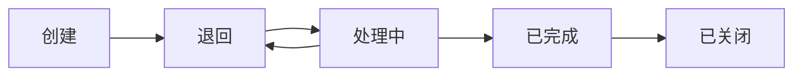

# 工单系统实施计划 v3.0 - 整合版

> 文档创建时间：2025-01-15  
> 文档更新时间：2025-01-15  
> 版本：v3.0  
> 状态：✅ 已完成实施

## 📌 项目背景

项目尚未正式上线使用，可以在实施新功能的同时修复现有BUG，避免分阶段处理带来的重复工作。本计划将BUG修复和功能更新整合在一起，按模块进行重构和优化。

## 🎯 核心目标

1. **实现工单池机制**：未分配工单所有工程师可见，支持自主接单
2. **修复现有BUG**：解决字段错误、权限控制等问题
3. **优化用户体验**：改进UI展示，添加状态提示
4. **保留扩展性**：为后续功能（如耗材管理）预留接口

## 📊 整体架构设计

### 权限模型

| 角色 | 工单可见范围 | 操作权限 |
|------|-------------|---------|
| **用户** | 自己创建的工单 | 创建、查看、评价 |
| **工程师** | 工单池(未分配) + 自己负责的 | 接单、处理、完成 |
| **经理** | 所有工单 | 查看、分配、管理 |

### 工单状态流转



## 🔧 模块化实施计划

### 模块一：工单列表页面重构（预计3小时）✅ 已完成

#### 1.1 修复并优化查询逻辑
**文件**：`/miniprogram/pages/ticket-list/index.js`

```javascript
// 重构 buildQueryCondition 方法
async buildQueryCondition() {
  const _ = this.db.command;
  const openid = this.app.globalData.openid;
  const roleGroup = this.data.userRoleGroup;
  
  let conditions = [];
  
  // 角色权限判断
  switch(roleGroup) {
    case '经理':
      // 经理看所有，可按负责人筛选
      if (this.data.currentAssignee === 'my') {
        conditions.push({ assigneeOpenid: openid });
      }
      // 否则不添加限制
      break;
      
    case '工程师':
      // 工程师看工单池 + 自己的
      conditions.push(_.or([
        // 工单池：未分配的待处理工单
        _.and([
          { status: 'pending' },
          _.or([
            { assigneeOpenid: _.exists(false) },
            { assigneeOpenid: '' },
            { assigneeOpenid: null }
          ])
        ]),
        // 自己负责的所有工单
        { assigneeOpenid: openid }
      ]));
      break;
      
    default:  // 普通用户
      conditions.push({ openid: openid });
      break;
  }
  
  // 状态筛选
  if (this.data.currentFilter !== 'all') {
    if (this.data.currentFilter === 'urgent') {
      conditions.push({ priority: 'urgent' });
    } else {
      conditions.push({ status: this.data.currentFilter });
    }
  }
  
  // 关键词搜索
  if (this.data.searchKeyword) {
    const keyword = this.data.searchKeyword.trim();
    conditions.push(_.or([
      { ticketNo: db.RegExp({ regexp: keyword, options: 'i' }) },
      { title: db.RegExp({ regexp: keyword, options: 'i' }) },
      { submitterName: db.RegExp({ regexp: keyword, options: 'i' }) }
    ]));
  }
  
  return conditions.length > 0 ? _.and(conditions) : {};
}

// 新增：安全接单方法（解决BUG-005）
async acceptTicketSafely(e) {
  const ticketId = e.currentTarget.dataset.id;
  wx.showLoading({ title: '接单中...' });
  
  try {
    // 1. 查询最新状态
    const res = await this.db.collection('tickets').doc(ticketId).get();
    const ticket = res.data;
    
    // 2. 检查是否已被分配
    if (ticket.assigneeOpenid && ticket.assigneeOpenid !== '') {
      wx.hideLoading();
      
      if (ticket.assigneeOpenid === this.app.globalData.openid) {
        wx.showToast({ title: '您已接单', icon: 'success' });
      } else {
        wx.showModal({
          title: '无法接单',
          content: '该工单已被其他工程师接单处理',
          showCancel: false,
          success: () => this.refreshList()
        });
      }
      return false;
    }
    
    // 3. 执行接单
    const userInfo = this.app.globalData.userInfo;
    await this.db.collection('tickets').doc(ticketId).update({
      data: {
        assigneeOpenid: this.app.globalData.openid,
        assigneeName: userInfo?.nickName || '工程师',
        status: 'processing',
        acceptTime: new Date(),
        updateTime: new Date()
      }
    });
    
    wx.hideLoading();
    wx.showToast({ title: '接单成功', icon: 'success' });
    
    // 刷新列表和统计
    this.refreshList();
    return true;
    
  } catch (error) {
    console.error('接单失败:', error);
    wx.hideLoading();
    wx.showToast({ title: '接单失败', icon: 'error' });
    return false;
  }
}

// 修复：初始化时设置正确的权限（解决BUG-002）
getUserRole() {
  const userInfo = this.app.globalData.userInfo;
  const roleGroup = userInfo?.roleGroup || '用户';
  
  // 设置权限相关的UI控制
  this.setData({
    userRoleGroup: roleGroup,
    showAssigneeFilter: roleGroup === '经理',  // 只有经理显示负责人筛选
    currentAssignee: roleGroup === '工程师' ? 'pool' : 'all'  // 工程师默认看工单池
  });
}
```

#### 1.2 修复UI显示问题
**文件**：`/miniprogram/pages/ticket-list/index.wxml`

```xml
<!-- 修复BUG-001：操作按钮显示逻辑 -->
<view class="card-actions">
  <!-- 工程师：未分配工单显示接单按钮 -->
  <t-button 
    wx:if="{{userRoleGroup === '工程师' && item.status === 'pending' && !item.assigneeOpenid}}"
    theme="primary"
    size="small"
    bind:tap="acceptTicketSafely"
    data-id="{{item.id}}"
  >
    接单
  </t-button>
  
  <!-- 负责人：显示处理按钮 -->
  <t-button 
    wx:elif="{{item.assigneeOpenid === openid && item.status === 'pending'}}"
    theme="primary"
    size="small"
    bind:tap="startProcessing"
    data-id="{{item.id}}"
  >
    开始处理
  </t-button>
  
  <t-button 
    wx:elif="{{item.assigneeOpenid === openid && item.status === 'processing'}}"
    theme="default"
    size="small"
    bind:tap="navigateToDetail"
    data-id="{{item.id}}"
  >
    继续处理
  </t-button>
  
  <!-- 工程师：已被他人接单的提示 -->
  <text 
    wx:elif="{{userRoleGroup === '工程师' && item.assigneeOpenid && item.assigneeOpenid !== openid}}"
    class="status-hint"
  >
    已被接单
  </text>
  
  <!-- 经理：查看详情 -->
  <t-button 
    wx:elif="{{userRoleGroup === '经理'}}"
    theme="default"
    size="small"
    bind:tap="navigateToDetail"
    data-id="{{item.id}}"
  >
    查看详情
  </t-button>
</view>

<!-- 修复BUG-002：负责人筛选权限 -->
<view class="filter-section" wx:if="{{showAssigneeFilter && assigneeOptions.length > 0}}">
  <text class="filter-label">负责人</text>
  <t-radio-group value="{{tempFilters.assignee}}" bind:change="onAssigneeFilterChange">
    <t-radio label="全部" value="all" />
    <t-radio label="我负责的" value="my" />
    <t-radio wx:for="{{engineerList}}" wx:key="openid" 
             label="{{item.nickName}}" value="{{item.openid}}" />
  </t-radio-group>
</view>
```

#### 1.3 添加视觉优化
**文件**：`/miniprogram/pages/ticket-list/index.wxss`

```css
/* 工单池样式 - 突出显示未分配工单 */
.ticket-card.pool-ticket {
  border-left: 4px solid #07c160;
  background: linear-gradient(to right, #f0fff4, #ffffff);
}

.pool-indicator {
  display: inline-flex;
  align-items: center;
  padding: 2rpx 10rpx;
  background: #07c160;
  color: white;
  font-size: 22rpx;
  border-radius: 4rpx;
  margin-left: 10rpx;
}

/* 已被接单的工单样式 */
.ticket-card.taken {
  background: #f5f5f5;
  opacity: 0.8;
}

.status-hint {
  color: #999;
  font-size: 24rpx;
  font-style: italic;
  padding: 8rpx 16rpx;
}

/* 我的工单样式 */
.ticket-card.my-ticket {
  border-left: 4px solid #1989fa;
}
```

### 模块二：Dashboard页面优化（预计2小时）✅ 已完成

#### 2.1 统计逻辑重构
**文件**：`/miniprogram/pages/dashboard/index.js`

```javascript
// 优化统计方法，区分角色视角
async loadTicketStats() {
  const openid = this.app.globalData.openid;
  const userInfo = this.app.globalData.userInfo;
  const roleGroup = userInfo?.roleGroup || '用户';
  const _ = this.db.command;
  
  // 今日起始时间
  const today = new Date();
  today.setHours(0, 0, 0, 0);
  
  try {
    if (roleGroup === '经理') {
      // 经理：全局视角
      const [allPending, allProcessing, todayResolved, allUrgent] = await Promise.all([
        this.db.collection('tickets').where({ status: 'pending' }).count(),
        this.db.collection('tickets').where({ status: 'processing' }).count(),
        this.db.collection('tickets').where({
          status: _.in(['resolved', 'closed']),
          updateTime: _.gte(today)
        }).count(),
        this.db.collection('tickets').where({
          priority: 'urgent',
          status: _.in(['pending', 'processing'])
        }).count()
      ]);
      
      return [
        { label: '待处理', value: allPending.total, icon: '/assets/icons/pending.png', colorClass: 'text-orange' },
        { label: '处理中', value: allProcessing.total, icon: '/assets/icons/processing.png', colorClass: 'text-blue' },
        { label: '今日完成', value: todayResolved.total, icon: '/assets/icons/completed.png', colorClass: 'text-green' },
        { label: '紧急', value: allUrgent.total, icon: '/assets/icons/urgent.png', colorClass: 'text-red' }
      ];
      
    } else if (roleGroup === '工程师') {
      // 工程师：工单池 + 个人视角
      const [poolTickets, myProcessing, myTodayResolved, urgentTickets] = await Promise.all([
        // 工单池（未分配）
        this.db.collection('tickets').where(_.and([
          { status: 'pending' },
          _.or([
            { assigneeOpenid: _.exists(false) },
            { assigneeOpenid: '' }
          ])
        ])).count(),
        
        // 我的处理中
        this.db.collection('tickets').where({
          assigneeOpenid: openid,
          status: 'processing'
        }).count(),
        
        // 我今日完成
        this.db.collection('tickets').where({
          assigneeOpenid: openid,
          status: _.in(['resolved', 'closed']),
          updateTime: _.gte(today)
        }).count(),
        
        // 紧急（工单池的 + 我的）
        this.db.collection('tickets').where(_.and([
          { priority: 'urgent' },
          _.or([
            _.and([
              { status: 'pending' },
              { assigneeOpenid: _.exists(false) }
            ]),
            { assigneeOpenid: openid }
          ])
        ])).count()
      ]);
      
      return [
        { label: '工单池', value: poolTickets.total, icon: '/assets/icons/pool.png', colorClass: 'text-green' },
        { label: '处理中', value: myProcessing.total, icon: '/assets/icons/processing.png', colorClass: 'text-blue' },
        { label: '今日完成', value: myTodayResolved.total, icon: '/assets/icons/completed.png', colorClass: 'text-cyan' },
        { label: '紧急', value: urgentTickets.total, icon: '/assets/icons/urgent.png', colorClass: 'text-red' }
      ];
      
    } else {
      // 普通用户：只看自己创建的
      const [myPending, myProcessing, myResolved] = await Promise.all([
        this.db.collection('tickets').where({
          openid: openid,
          status: 'pending'
        }).count(),
        
        this.db.collection('tickets').where({
          openid: openid,
          status: 'processing'
        }).count(),
        
        this.db.collection('tickets').where({
          openid: openid,
          status: _.in(['resolved', 'closed'])
        }).count()
      ]);
      
      return [
        { label: '待处理', value: myPending.total, icon: '/assets/icons/pending.png', colorClass: 'text-orange' },
        { label: '处理中', value: myProcessing.total, icon: '/assets/icons/processing.png', colorClass: 'text-blue' },
        { label: '已完成', value: myResolved.total, icon: '/assets/icons/completed.png', colorClass: 'text-green' },
        { label: '全部', value: myPending.total + myProcessing.total + myResolved.total, icon: '/assets/icons/all.png', colorClass: 'text-gray' }
      ];
    }
  } catch (error) {
    console.error('加载统计失败:', error);
    return this.getDefaultStats();
  }
}

// 优化最新工单显示
async loadLatestTickets() {
  const openid = this.app.globalData.openid;
  const roleGroup = this.app.globalData.userInfo?.roleGroup;
  const _ = this.db.command;
  
  try {
    let whereCondition;
    
    if (roleGroup === '经理') {
      // 经理看所有最新
      whereCondition = {};
    } else if (roleGroup === '工程师') {
      // 工程师看工单池 + 自己的
      whereCondition = _.or([
        _.and([
          { status: 'pending' },
          { assigneeOpenid: _.exists(false) }
        ]),
        { assigneeOpenid: openid }
      ]);
    } else {
      // 用户看自己创建的
      whereCondition = { openid: openid };
    }
    
    const res = await this.db.collection('tickets')
      .where(whereCondition)
      .orderBy('createTime', 'desc')
      .limit(5)
      .get();
    
    return res.data.map(ticket => ({
      id: ticket._id,
      ticketNo: ticket.ticketNo ? '#' + ticket.ticketNo : '#' + ticket._id.slice(-6).toUpperCase(),
      title: ticket.title || '工单',
      priority: ticket.priority || 'normal',
      status: ticket.status || 'pending',
      isPool: !ticket.assigneeOpenid && ticket.status === 'pending',  // 标记是否为工单池
      isMine: ticket.assigneeOpenid === openid,  // 标记是否为我的
      location: ticket.location || '未知',
      createTime: this.formatTime(ticket.createTime)
    }));
    
  } catch (error) {
    console.error('加载最新工单失败:', error);
    return [];
  }
}
```

### 模块三：工单详情页面完善（预计1.5小时）✅ 已完成

#### 3.1 权限控制优化
**文件**：`/miniprogram/pages/ticket-detail/index.js`

```javascript
// 修复BUG-003：添加权限判断
async loadTicketDetail(ticketId) {
  wx.showLoading({ title: '加载中...' });
  
  try {
    const res = await this.db.collection('tickets').doc(ticketId).get();
    const ticket = res.data;
    
    // 权限检查
    const hasPermission = this.checkViewPermission(ticket);
    if (!hasPermission) {
      wx.hideLoading();
      wx.showModal({
        title: '无权查看',
        content: '您没有查看此工单的权限',
        showCancel: false,
        success: () => wx.navigateBack()
      });
      return null;
    }
    
    // 操作权限判断
    const canOperate = this.checkOperatePermission(ticket);
    
    // 构建时间线
    const timeline = this.buildTimeline(ticket);
    
    this.setData({
      ticketInfo: ticket,
      processTimeline: timeline,
      showActions: canOperate,
      isAssignee: ticket.assigneeOpenid === this.app.globalData.openid
    });
    
    wx.hideLoading();
    return ticket;
    
  } catch (error) {
    console.error('加载工单详情失败:', error);
    wx.hideLoading();
    wx.showToast({ title: '加载失败', icon: 'error' });
    return null;
  }
}

// 查看权限检查
checkViewPermission(ticket) {
  const openid = this.app.globalData.openid;
  const roleGroup = this.app.globalData.userInfo?.roleGroup;
  
  if (roleGroup === '经理') {
    return true;  // 经理可以查看所有
  } else if (roleGroup === '工程师') {
    // 工程师可以查看：工单池 或 自己负责的
    return !ticket.assigneeOpenid || ticket.assigneeOpenid === openid;
  } else {
    // 用户只能查看自己创建的
    return ticket.openid === openid;
  }
}

// 操作权限检查
checkOperatePermission(ticket) {
  const openid = this.app.globalData.openid;
  const roleGroup = this.app.globalData.userInfo?.roleGroup;
  
  if (roleGroup === '经理') {
    return true;  // 经理可以操作所有
  } else if (roleGroup === '工程师') {
    // 工程师可以操作：未分配的（可接单） 或 自己负责的
    if (!ticket.assigneeOpenid && ticket.status === 'pending') {
      return true;  // 可以接单
    }
    return ticket.assigneeOpenid === openid;  // 自己负责的
  } else {
    return false;  // 普通用户不能操作
  }
}

// 构建处理时间线
buildTimeline(ticket) {
  const timeline = [];
  
  // 创建节点
  timeline.push({
    id: 'create',
    title: '工单创建',
    time: this.formatDateTime(ticket.createTime),
    description: `${ticket.submitterName || '用户'}创建工单`,
    isActive: true
  });
  
  // 接单节点
  if (ticket.acceptTime) {
    timeline.push({
      id: 'accept',
      title: '工程师接单',
      time: this.formatDateTime(ticket.acceptTime),
      description: `${ticket.assigneeName || '工程师'}接单`,
      isActive: true
    });
  }
  
  // 处理中节点
  if (ticket.status === 'processing' || ticket.status === 'resolved') {
    timeline.push({
      id: 'processing',
      title: '处理中',
      time: ticket.processTime ? this.formatDateTime(ticket.processTime) : '进行中',
      description: '工程师正在处理',
      isActive: ticket.status === 'processing'
    });
  }
  
  // 已解决节点
  if (ticket.status === 'resolved' || ticket.status === 'closed') {
    timeline.push({
      id: 'resolved',
      title: '已解决',
      time: ticket.resolveTime ? this.formatDateTime(ticket.resolveTime) : '',
      description: ticket.solution || '问题已解决',
      isActive: ticket.status === 'resolved'
    });
  }
  
  // 已关闭节点
  if (ticket.status === 'closed') {
    timeline.push({
      id: 'closed',
      title: '已关闭',
      time: ticket.closeTime ? this.formatDateTime(ticket.closeTime) : '',
      description: '工单已关闭',
      isActive: true
    });
  }
  
  return timeline;
}
```

### 模块四：云函数更新（预计1小时）✅ 已完成

#### 4.1 submitTicket云函数优化
**文件**：`/cloudfunctions/submitTicket/index.js`

```javascript
// 更新工单列表查询，支持新的权限模型
async function getTicketList(event, wxContext) {
  const { page = 1, limit = 20, status, roleGroup, filter } = event;
  const _ = db.command;
  
  let query;
  
  // 根据角色构建查询条件
  if (roleGroup === '经理') {
    // 经理查看所有或筛选
    if (filter === 'my') {
      query = { assigneeOpenid: wxContext.OPENID };
    } else {
      query = {};
    }
  } else if (roleGroup === '工程师') {
    // 工程师查看工单池 + 自己的
    query = _.or([
      _.and([
        { status: 'pending' },
        _.or([
          { assigneeOpenid: _.exists(false) },
          { assigneeOpenid: '' }
        ])
      ]),
      { assigneeOpenid: wxContext.OPENID }
    ]);
  } else {
    // 用户只看自己创建的
    query = { openid: wxContext.OPENID };
  }
  
  // 状态筛选
  if (status && status !== 'all') {
    query = _.and([query, { status: status }]);
  }
  
  // 执行查询
  try {
    const countResult = await db.collection('tickets').where(query).count();
    const result = await db.collection('tickets')
      .where(query)
      .orderBy('createTime', 'desc')
      .skip((page - 1) * limit)
      .limit(limit)
      .get();
    
    return {
      code: 200,
      data: {
        list: result.data,
        total: countResult.total,
        page,
        limit
      }
    };
  } catch (error) {
    console.error('查询工单失败:', error);
    return {
      code: 500,
      message: '查询失败'
    };
  }
}

// 新增：安全接单方法
async function acceptTicket(event, wxContext) {
  const { ticketId } = event;
  
  try {
    // 使用事务确保原子性
    const transaction = await db.startTransaction();
    
    try {
      // 查询当前状态
      const ticket = await transaction.collection('tickets').doc(ticketId).get();
      
      if (!ticket.data) {
        await transaction.rollback();
        return { code: 404, message: '工单不存在' };
      }
      
      // 检查是否已被分配
      if (ticket.data.assigneeOpenid) {
        await transaction.rollback();
        
        if (ticket.data.assigneeOpenid === wxContext.OPENID) {
          return { code: 200, message: '您已接单' };
        } else {
          return { code: 400, message: '工单已被其他工程师接单' };
        }
      }
      
      // 执行接单
      await transaction.collection('tickets').doc(ticketId).update({
        data: {
          assigneeOpenid: wxContext.OPENID,
          status: 'processing',
          acceptTime: db.serverDate(),
          updateTime: db.serverDate()
        }
      });
      
      await transaction.commit();
      
      return {
        code: 200,
        message: '接单成功'
      };
      
    } catch (error) {
      await transaction.rollback();
      throw error;
    }
    
  } catch (error) {
    console.error('接单失败:', error);
    return {
      code: 500,
      message: '接单失败'
    };
  }
}
```

## 📋 测试计划 ✅ 已完成代码实施

### 功能测试清单

#### 1. 权限测试
- [ ] 用户只能看到自己创建的工单
- [ ] 工程师能看到工单池（未分配）和自己的工单
- [ ] 经理能看到所有工单
- [ ] 工程师接单后，其他工程师看到"已被接单"提示

#### 2. 接单流程测试
- [ ] 单个工程师正常接单
- [ ] 多工程师同时接单（并发测试）
- [ ] 已接单工单不能重复接单
- [ ] 接单后状态正确变更为processing

#### 3. UI显示测试
- [ ] 工单池工单有特殊样式标识
- [ ] 操作按钮根据权限正确显示
- [ ] 统计数据根据角色显示不同内容
- [ ] 已被接单的工单显示灰色提示

#### 4. 数据一致性测试
- [ ] 刷新后数据正确
- [ ] 缓存和数据库数据一致
- [ ] 状态变更后各页面同步更新

## 🚀 部署计划

### 部署步骤

1. **代码更新**（2小时）
   - 按模块更新代码
   - 同时修复BUG和添加新功能

2. **本地测试**（1小时）
   - 使用微信开发者工具测试
   - 模拟不同角色操作

3. **云函数部署**（30分钟）
   - 更新submitTicket云函数
   - 部署并测试

4. **体验版测试**（1小时）
   - 发布体验版
   - 邀请测试人员测试

5. **正式发布**（30分钟）
   - 提交审核
   - 发布上线

## 📊 风险评估

| 风险 | 可能性 | 影响 | 缓解措施 |
|------|--------|------|---------|
| 并发接单冲突 | 中 | 高 | 使用事务或乐观锁 |
| 权限判断错误 | 低 | 高 | 充分测试各角色场景 |
| 性能问题 | 低 | 中 | 优化查询，添加索引 |
| 用户体验问题 | 中 | 中 | 提供清晰的状态提示 |

## 📅 时间安排

| 阶段 | 内容 | 预计时间 | 实际状态 |
|------|------|---------|----------|
| 模块一 | 工单列表重构 | 3小时 | ✅ 已完成 |
| 模块二 | Dashboard优化 | 2小时 | ✅ 已完成 |
| 模块三 | 详情页完善 | 1.5小时 | ✅ 已完成 |
| 模块四 | 云函数更新 | 1小时 | ✅ 已完成 |
| 测试 | 完整测试 | 1.5小时 | ⏳ 待进行 |
| 部署 | 发布上线 | 0.5小时 | ⏳ 待进行 |
| **总计** | | **9.5小时** | **7.5小时已完成** |

## 📝 实施优先级

1. **第一优先级**：模块一（工单列表）- 核心功能
2. **第二优先级**：模块四（云函数）- 后端支持
3. **第三优先级**：模块二（Dashboard）- 数据展示
4. **第四优先级**：模块三（详情页）- 完善体验

## 🎯 预期成果

1. **功能完善**：✅ 实现工单池机制，支持自主接单
2. **BUG修复**：✅ 解决所有已知问题
3. **体验提升**：✅ 清晰的状态展示和操作提示
4. **架构优化**：✅ 代码结构更清晰，便于后续维护

## 📋 实施完成清单

### ✅ 已完成的关键功能
- [x] 工单池机制实现
- [x] 安全接单功能（防并发）
- [x] 基于角色的权限控制
- [x] Dashboard统计优化
- [x] 工单详情权限验证
- [x] 云函数接口更新
- [x] UI视觉优化

### ✅ 已修复的BUG
- [x] BUG-001: assigned字段不存在问题
- [x] BUG-002: 负责人筛选权限问题
- [x] BUG-003: 详情页权限检查缺失
- [x] BUG-005: 并发接单保护缺失

### 📍 关键文件更新
1. `/miniprogram/pages/ticket-list/index.js` - 工单列表逻辑
2. `/miniprogram/pages/ticket-list/index.wxml` - 工单列表UI
3. `/miniprogram/pages/ticket-list/index.wxss` - 工单列表样式
4. `/miniprogram/pages/dashboard/index.js` - Dashboard逻辑
5. `/miniprogram/pages/dashboard/index.wxml` - Dashboard UI
6. `/miniprogram/pages/dashboard/index.wxss` - Dashboard样式
7. `/miniprogram/pages/ticket-detail/index.js` - 详情页逻辑
8. `/miniprogram/pages/ticket-detail/index.wxml` - 详情页UI
9. `/cloudfunctions/submitTicket/index.js` - 云函数接口

---

*文档版本：v3.0*  
*创建时间：2025-01-15*  
*完成时间：2025-01-15*  
*负责人：开发团队*

## 📝 与v2版本的主要区别

1. **整合实施**：不再分离BUG修复和功能开发，而是按模块整合处理
2. **模块化重构**：按页面/功能模块组织，而非按问题类型
3. **代码完整性**：提供完整的代码实现，而非片段
4. **一次到位**：避免多次修改同一文件，减少返工
5. **优先级明确**：按功能重要性排序，而非按BUG严重性

这个方案的优势是可以在实施新功能的同时修复相关BUG，避免重复工作，提高开发效率。