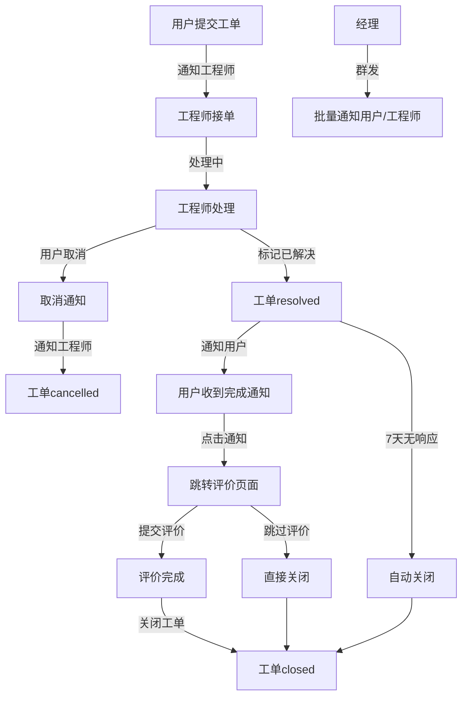

# 评价系统与通知系统综合实施方案

## 📋 方案概述

本方案将**评价系统**和**通知系统**作为一个整体功能进行同步开发，通过订阅消息通知提升用户评价率，形成完整的工单处理闭环。

### 🎯 核心目标
1. **提升评价率**：通过通知引导用户及时评价（目标：80%+）
2. **改善响应速度**：新工单及时通知工程师（目标：5分钟内响应）
3. **流程自动化**：状态变更自动触发相应通知
4. **用户体验优化**：减少用户主动查询，主动推送状态更新

## 🔄 业务流程整合

### 完整工单生命周期（含取消流程）


## 🏗 技术架构

### 系统关联图（更新版）
```
┌─────────────────────────────────────────────────┐
│                   用户端小程序                    │
├─────────────────────────────────────────────────┤
│  创建工单 → 订阅通知 → 接收完成通知 → 评价工单    │
│  取消工单 → 触发取消通知 | 接收经理公告          │
└──────────────────┬──────────────────────────────┘
                   │
        ┌──────────▼──────────┐
        │    云函数层          │
        │  ┌──────────────┐  │
        │  │ submitTicket │  │  ← 核心函数（含评价+通知+取消）
        │  ├──────────────┤  │
        │  │sendNotification│ │  ← 统一通知函数（5种类型）
        │  ├──────────────┤  │
        │  │managerBroadcast│ │  ← 经理群发函数
        │  └──────────────┘  │
        └──────────┬──────────┘
                   │
┌──────────────────▼──────────────────────────────┐
│                  工程师端小程序                   │
├─────────────────────────────────────────────────┤
│  接收新工单通知 → 处理工单 → 标记完成 → 等待评价  │
│  接收取消通知 → 停止处理 | 接收经理通知          │
└─────────────────────────────────────────────────┘
                   │
┌──────────────────▼──────────────────────────────┐
│                  经理端功能                      │
├─────────────────────────────────────────────────┤
│  群发用户通知 | 群发工程师通知 | 查看发送统计     │
└─────────────────────────────────────────────────┘
```

## 🔎 当前仓库现状对齐

- `cloudfunctions/submitTicket/index.js:47`: 现有 `switch` 中未包含 `addRating` / `closeByUser` / `cancelTicket`，且仍允许 `rated` 状态；与本方案的“评价后即 closed”的目标存在差异。
- `cloudfunctions/`: 尚未创建 `sendNotification` 与 `recordSubscription` 云函数；本方案中的通知与订阅配额需新增实现。
- `miniprogram/utils/realtime-manager.js:131`: 已实现对 `notifications` 集合的实时监听及新消息提醒；但项目中尚未看到该集合的服务端写入流程与落表设计，需要结合本方案的订阅消息或作为补充通道。
- `miniprogram/pages/dashboard/index.js:1112`: 已有对 `notifications` 集合未读计数的读取示例，后续需与统一通知发送落表保持一致。

命名规范统一（文档内已修订）：
- 统一通知类型命名使用下划线风格：`ticket_complete` | `new_ticket` | `ticket_cancelled` | `manager_notice`
- 将文档中出现过的 `cancel_notification`、`manager_broadcast` 统一为 `ticket_cancelled`、`manager_notice`

## 📊 实施计划（3天完成）

### Day 1：基础架构搭建（核心功能）

#### 上午（4小时）：云函数层实现
1. **改造 submitTicket 云函数**（2小时）
   ```javascript
   // 新增actions
   case 'addRating':      // 保存评价数据
   case 'closeByUser':    // 用户关闭工单
   case 'cancelTicket':   // 🆕 取消工单
   ```

2. **创建统一 sendNotification 云函数**（2小时）
   - 工单完成通知
   - 新工单通知
   - 🆕 工单取消通知
   - 🆕 经理群发通知

#### 下午（4小时）：数据库设计
1. **扩展 tickets 集合**（1小时）
   ```javascript
   {
     // 评价相关
     rating: {
       overall: Number,
       speed: Number,
       quality: Number,
       resolution: Number,
       comment: String,
       ratedAt: Date
     },
     // 通知相关
     notifications: {
       userNotified: Boolean,
       engineerNotified: Boolean,
       notificationTimes: []
     },
     // 关闭相关
     closedBy: String,
     closedAt: Date,
     closedReason: String
   }
   ```

2. **创建订阅集合**（1小时）
   - user_subscriptions
   - engineer_subscriptions
   - 🆕 manager_broadcasts（群发记录，类型统一命名为 `manager_notice`）

3. **申请消息模板**（2小时）
   - 用户端：工单完成通知、🆕 经理公告通知
   - 工程师端：新工单通知、🆕 工单取消通知、🆕 经理通知

### Day 2：前端功能实现

#### 上午（4小时）：用户端改造
1. **修复评价页面流程**（2小时）
   ```javascript
   // /mini_program/pages/rating/index.js
   async submitRating() {
     // 1. 调用addRating保存评价
     await wx.cloud.callFunction({
       name: 'submitTicket',
       data: { action: 'addRating', ... }
     });
     
     // 2. 调用closeByUser关闭工单
     await wx.cloud.callFunction({
       name: 'submitTicket',
       data: { action: 'closeByUser', ... }
     });
   }
   ```

2. **集成订阅消息**（1小时）
   - 创建工单时请求订阅
   - 订阅状态管理

3. **优化工单列表显示**（1小时）
   - 统一状态显示（rated → closed）
   - 添加评价提醒标识
   - 🆕 添加取消工单按钮

#### 下午（4小时）：工程师端改造 + 经理功能
1. **更新状态显示文案**（1小时）
   ```javascript
   statusText: {
     resolved: '待用户确认',
     closed: '已完成'
   }
   ```

2. **集成通知接收**（1小时）
   - 登录时订阅请求
   - 通知权限管理

3. **完善提示信息**（1小时）
   - resolved状态添加等待提示
   - 显示用户评价信息

4. **🆕 创建经理群发页面**（1小时）
   - 选择发送对象（用户/工程师）
   - 编写通知内容
   - 查看发送统计

### Day 3：测试与优化

#### 上午（4小时）：集成测试
1. **完整流程测试**（2小时）
   - 创建工单 → 工程师收到通知
   - 工程师处理 → 标记完成
   - 用户收到通知 → 评价
   - 评价完成 → 工单关闭

2. **异常流程测试**（2小时）
   - 权限验证
   - 重复评价拦截
   - 通知发送失败处理

#### 下午（4小时）：优化与部署
1. **性能优化**（2小时）
   - 批量通知发送
   - 失败重试机制

2. **部署上线**（2小时）
   - 云函数部署
   - 小程序发布

## ⚠️ 基于官方文档的重要调整

### 订阅消息关键限制与突破
1. **一次订阅一次推送**：用户每次订阅只能收到一条消息
   - 🔑 **突破方法**：利用"总是保持以上选择"实现静默订阅
2. **需要用户主动触发**：必须通过用户点击行为触发订阅请求
3. **模板需要审核**：申请模板需要1-3个工作日审核
4. **不支持长期订阅**：普通小程序只能使用一次性订阅
5. **无需夜间免打扰**：按需求已移除，24小时服务

6. **小程序边界限制（重要）**：订阅消息只能在同一个小程序内发送。若“用户端小程序”和“工程师端小程序”为两个不同的 AppID，则各自只能向本应用用户发送通知，不能跨应用发送；需分别在各自云环境中部署 `sendNotification` 并管理各自的 `openid/订阅配额`。

### 优化后的通知策略（利用"总是保持"）
```javascript
// 用户端策略：每次操作都请求（积累权限）
// 1. 创建工单时 - 请求订阅，获得一次完成通知权限
// 2. 查看工单时 - 可选请求，增加通知权限
// 3. 首次引导勾选"总是保持以上选择"

// 工程师端策略：高频请求（累积权限）
// 1. 登录时 - 批量请求多个模板
// 2. 接单时 - 可选请求额外权限
// 3. 用户选择"总是保持"后静默获取

// 订阅次数管理
// 1. 数据库记录每次订阅
// 2. 发送前检查可用次数
// 3. 使用后立即标记
```

## 🔧 关键实现细节

### 1. 统一的状态流转管理

```javascript
// cloudfunctions/submitTicket/index.js
async function handleStatusTransition(ticketId, fromStatus, toStatus, operator) {
  const transitions = {
    'processing->resolved': async () => {
      // 工程师完成工单
      await updateTicketStatus(ticketId, 'resolved');
      await notifyUserComplete(ticketId); // 触发用户通知
    },
    'resolved->closed': async () => {
      // 用户评价后关闭
      await updateTicketStatus(ticketId, 'closed');
      await recordRating(ticketId);
    }
  };
  
  const key = `${fromStatus}->${toStatus}`;
  if (transitions[key]) {
    await transitions[key]();
  }
}
```

### 2. 智能订阅管理（Promise 化 + 可静默探测）

```javascript
// utils/wxp.js：统一 Promise 适配与静默探测（示例）
import { wxp, canSilentSubscribe } from '../../utils/wxp';

// 用户端：每次创建工单都请求（需绑定交互）
async function createTicketWithSubscription() {
  if (isFirstTime()) {
    await wxp.showModal({
      title: '订阅提示',
      content: '建议勾选"总是保持以上选择"，方便接收工单处理进度',
      showCancel: false
    });
  }
  const res = await wxp.requestSubscribeMessage({ tmplIds: ['完成通知模板ID'] });
  if (res['完成通知模板ID'] === 'accept') {
    await wx.cloud.callFunction({
      name: 'recordSubscription',
      data: { acceptedTemplateIds: ['完成通知模板ID'], typeMap: { '完成通知模板ID': 'ticket_complete' } }
    });
  }
}

// 工程师端：仅在可静默时登录自动请求，否则提供按钮
async function engineerLoginSubscribe() {
  const tmplIds = ['新工单通知ID', '取消通知ID', '经理通知ID'];
  if (!(await canSilentSubscribe(tmplIds))) {
    this.setData({ showEnableNoticeBtn: true });
    return; // 由用户点击按钮触发订阅
  }
  const res = await wxp.requestSubscribeMessage({ tmplIds });
  const accepted = Object.entries(res).filter(([,v]) => v === 'accept').map(([k]) => k);
  if (accepted.length) {
    await wx.cloud.callFunction({
      name: 'recordSubscription',
      data: {
        acceptedTemplateIds: accepted,
        typeMap: {
          '新工单通知ID': 'new_ticket',
          '取消通知ID': 'ticket_cancelled',
          '经理通知ID': 'manager_notice'
        }
      }
    });
  }
}
```

### 3. 订阅次数管理与发送机制（预留+提交后发送）

```javascript
// 订阅次数数据库结构（增加保留/幂等字段）
// user_subscriptions 集合
{
  openid: String,
  type: String,        // ticket_complete/new_ticket/ticket_cancelled/manager_notice
  templateId: String,
  used: Boolean,       // 是否已使用
  status: String,      // available/pending/used/failed
  subscribedAt: Date,
  reservedAt: Date,    // 预留时间（pending）
  usedAt: Date
}

// cloudfunctions/sendNotification/index.js（示例：预留→提交后发送）
async function reserveAndSend(userId, type, buildMessage) {
  let reserved = null;
  try {
    // 1) 事务中仅做“预留”，不在事务中发送
    const r = await db.runTransaction(async trx => {
      const snap = await trx.collection('user_subscriptions')
        .where({ openid: userId, type, used: false, status: db.command.neq('pending') })
        .limit(1).get();
      if (!snap.data.length) return { ok: false, reason: 'no_subscription' };

      const sub = snap.data[0];
      await trx.collection('user_subscriptions').doc(sub._id).update({
        data: { status: 'pending', reservedAt: new Date() }
      });
      return { ok: true, sub };
    });

    if (!r.ok) return { success: false, reason: r.reason };
    reserved = r.sub;

    // 2) 事务提交后发送
    await cloud.openapi.subscribeMessage.send(buildMessage(reserved.templateId));

    // 3) 发送成功，标记为 used
    await db.collection('user_subscriptions').doc(reserved._id).update({
      data: { used: true, status: 'used', usedAt: new Date() }
    });
    return { success: true };
  } catch (err) {
    console.error('发送通知失败:', err);
    // 失败：回滚 pending 状态，允许下次重试
    if (reserved?._id) {
      await db.collection('user_subscriptions').doc(reserved._id).update({
        data: { status: 'available' }
      }).catch(() => {});
    }
    return { success: false, error: err.message };
  }
}

// 工具函数
function truncate(str, maxLength) {
  if (!str) return '';
  return str.length > maxLength ? str.substring(0, maxLength - 3) + '...' : str;
}
function formatTime(date) {
  const y = date.getFullYear();
  const m = String(date.getMonth() + 1).padStart(2, '0');
  const d = String(date.getDate()).padStart(2, '0');
  const h = String(date.getHours()).padStart(2, '0');
  const min = String(date.getMinutes()).padStart(2, '0');
  return `${y}-${m}-${d} ${h}:${min}`;
}
```

### 4. 评价激励机制

```javascript
// 评价后的奖励
async function rewardForRating(userId) {
  // 可以给予积分、优先处理权等奖励
  await db.collection('users').doc(userId).update({
    data: {
      points: db.command.inc(10),
      ratingCount: db.command.inc(1)
    }
  });
}
```

## 📈 预期效果指标（基于"总是保持"策略）

| 指标 | 当前值 | 目标值 | 提升幅度 | 关键因素 |
|------|--------|--------|----------|----------|
| 订阅接受率 | - | 70% | 新增 | 首次引导效果 |
| "总是保持"选择率 | - | 50% | 新增 | 用户体验优化 |
| 评价率 | 0% | 60-80% | +60-80% | 通知引导 |
| 平均响应时间 | 30分钟 | 5分钟 | -83% | 实时通知 |
| 工单完成通知率 | 0% | 90%+ | +90% | 订阅管理 |
| 工单取消及时率 | - | 95% | 新增 | 自动触发 |
| 用户满意度 | - | 4.5/5 | 新增 | 整体体验 |

## ⚠️ 风险控制

### 技术风险
1. **模板审核延迟**
   - 缓解：提前申请，准备备选方案
   
2. **并发通知限制**
   - 缓解：实现队列机制，分批发送

3. **订阅拒绝率高**
   - 缓解：优化请求时机，说明价值

### 业务风险
1. **通知骚扰**
   - 缓解：智能过滤，免打扰设置

2. **评价质量低**
   - 缓解：引导详细评价，奖励机制

## 🚀 快速启动指南

### Step 1：环境准备
```bash
# 1. 申请消息模板（需要1-3个工作日）
# 2. 配置云环境ID
# 3. 更新模板ID到代码中
```

### Step 2：部署云函数
```bash
# 部署核心函数
cd cloudfunctions/submitTicket
npm install
# 上传到云端

# 部署通知函数
cd ../sendNotification
npm install
# 上传到云端
```

### Step 3：前端集成
```javascript
// 1. 用户端集成
// pages/rating/index.js - 修复评价流程
// pages/my-tickets/index.js - 统一状态显示

// 2. 工程师端集成
// pages/ticket-list/index.js - 更新状态文案
// pages/ticket-detail/index.js - 优化提示
// pages/login/index.js - 可静默时自动订阅，否则提供“开启通知”按钮
// utils/wxp.js - Promise 适配 + canSilentSubscribe 能力探测
```

### Step 4：测试验证
1. 创建测试工单
2. 验证通知接收
3. 完成评价流程
4. 检查数据完整性

## 📋 核心改动清单

### 必须改动（Day 1）
- [ ] submitTicket云函数添加addRating、closeByUser、cancelTicket
- [ ] 用户端评价页面修复状态更新逻辑
- [ ] 创建统一sendNotification云函数（5种类型）

### 应该改动（Day 2）
- [ ] 工程师端状态文案优化
- [ ] 集成订阅消息请求
- [ ] 统一rated为closed状态
- [ ] 添加取消工单功能
- [ ] 创建经理群发页面

### 可选改动（Day 3）
- [ ] 自动关闭机制
- [ ] 评价奖励系统
- [ ] 通知统计分析
- [ ] 批量发送优化

## 🎯 成功标准

1. **功能完整性**
   - ✅ 评价功能正常运行
   - ✅ 通知及时送达
   - ✅ 状态流转正确

2. **用户体验**
   - ✅ 评价率达到50%以上
   - ✅ 无重复通知
   - ✅ 响应时间缩短

3. **系统稳定性**
   - ✅ 无数据丢失
   - ✅ 权限控制严格
   - ✅ 错误处理完善

---

*文档创建时间：2024-12-28*
*预计完成时间：3个工作日*
*风险等级：低*
*投入产出比：高*
