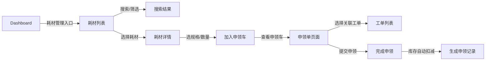
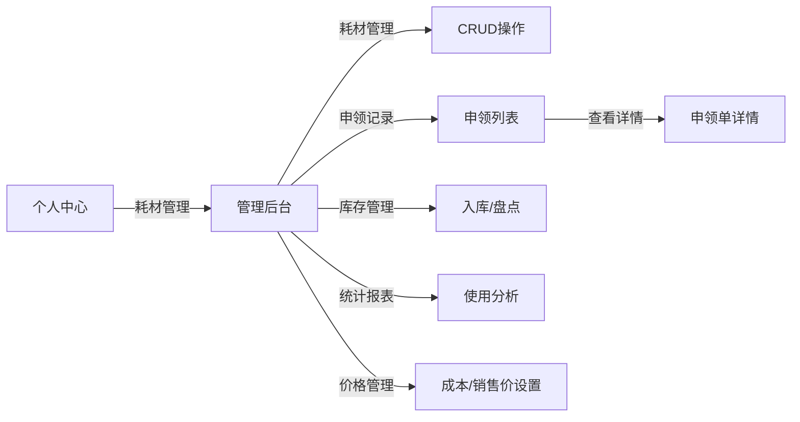

# 耗材管理系统设计文档（集成版）

> 基于现有IT工程师工作台系统架构，充分重用已有组件和模式

## 1. 系统概述

### 1.1 背景
在现有的工单管理系统基础上，扩展耗材管理功能模块，用于IT运维耗材的申领、库存管理和追踪。

### 1.2 设计原则
- **重用优先**：最大限度重用现有组件（如搜索、列表、详情页）
- **风格统一**：遵循现有UI设计规范（TDesign组件 + 本地图标）
- **架构一致**：沿用云函数 + 云数据库架构
- **权限延续**：使用现有的三级权限体系

## 2. 功能架构

### 2.1 模块关系
```
工单系统 <--关联--> 耗材管理
    |                  |
    v                  v
- 工单详情        - 耗材列表
- 工单处理        - 耗材申领
- 状态流转        - 库存管理
```

### 2.2 核心功能
- **耗材浏览**：类目分类、搜索、筛选（复用ticket-list搜索组件）
- **申领流程**：购物车模式、一次性申领、绑定工单
- **库存管理**：实时库存、安全库存、自动预警
- **权限控制**：基于现有roleGroup字段（User/Engineer/Manager）

## 3. 页面设计（重用现有组件）

### 3.1 耗材列表页
**路径**: `/pages/material-list/index`
**复用组件**:
- 搜索栏：复用 `ticket-list` 的搜索组件
- 列表容器：复用 `ticket-list` 的列表结构
- 筛选器：复用状态筛选组件，改为类目筛选
- 下拉刷新/上拉加载：直接复用

**新增特性**:
- 左侧类目导航（参考Dashboard快捷操作卡片布局）
- 底部申领车汇总条（固定定位）
- 数量步进器组件

### 3.2 耗材详情页
**路径**: `/pages/material-detail/index`
**复用组件**:
- 自定义导航栏：复用 `ticket-detail` 的导航栏
- 信息展示卡片：复用详情页的Cell组件布局
- 图片上传：复用头像上传逻辑（avatarUpload云函数）

**新增特性**:
- 规格选择器（Chip组件）
- 库存显示（进度条）
- 数量选择器

### 3.3 申领单页面（购物车）
**路径**: `/pages/material-cart/index`
**复用组件**:
- 列表项：复用SwipeCell滑动组件
- 表单：复用login/user-setup的表单样式
- 提交按钮：复用全局按钮样式

**新增特性**:
- 工单关联选择器（下拉选择当前用户的工单）
- 库存实时校验
- 批量修正功能

## 4. 数据库设计

### 4.1 materials集合（耗材表）
```javascript
{
  _id: String,              // 耗材ID
  materialNo: String,       // 耗材编号 MT20250819xxxxx
  name: String,             // 耗材名称
  category: String,         // 类目：paper/writing/print/clean/other
  description: String,      // 描述
  unit: String,             // 单位：个/盒/包/箱
  
  // 规格信息（单规格时variants数组只有一个元素）
  variants: [{
    variantId: String,      // 规格ID
    label: String,          // 规格名称
    costPrice: Number,      // 成本价（仅Manager可见）
    salePrice: Number,      // 销售价（仅Manager可见）
    stock: Number,          // 当前库存
    safetyStock: Number,    // 安全库存
    imageUrl: String        // 规格图片
  }],
  
  // 默认信息
  defaultImage: String,     // 默认展示图
  totalStock: Number,       // 总库存（所有规格之和）
  status: String,           // 状态：active/inactive/deleted
  
  // 时间戳
  createTime: Date,
  updateTime: Date,
  createdBy: String,        // 创建人openid
  updatedBy: String         // 最后修改人openid
}
```

### 4.2 requisitions集合（申领单表）
```javascript
{
  _id: String,              // 申领单ID
  requisitionNo: String,    // 申领单号 RQ20250819xxxxx
  
  // 申领人信息
  applicantOpenid: String,  // 申领人openid
  applicantName: String,    // 申领人姓名
  department: String,       // 部门
  
  // 关联信息
  ticketId: String,         // 关联工单ID（可选）
  ticketNo: String,         // 关联工单号（冗余字段，方便显示）
  
  // 申领明细
  items: [{
    materialId: String,     // 耗材ID
    materialNo: String,     // 耗材编号
    name: String,           // 耗材名称
    variantId: String,      // 规格ID
    variantLabel: String,   // 规格名称
    quantity: Number,       // 申领数量
    costPrice: Number,      // 成本价（记录申领时价格）
    salePrice: Number,      // 销售价（记录申领时价格）
    subtotal: Number        // 小计（基于销售价）
  }],
  
  // 汇总信息
  totalQuantity: Number,    // 总数量
  totalAmount: Number,      // 总金额（仅Manager可见）
  
  // 状态信息
  status: String,           // completed/cancelled（申领后直接完成）
  completedTime: Date,      // 完成时间
  
  // 其他
  note: String,             // 备注
  
  // 时间戳
  createTime: Date,
  updateTime: Date
}
```

### 4.3 material_logs集合（库存变动日志）
```javascript
{
  _id: String,
  materialId: String,       // 耗材ID
  variantId: String,        // 规格ID
  type: String,             // in/out/adjust（入库/出库/调整）
  quantity: Number,         // 变动数量（正负数）
  beforeStock: Number,      // 变动前库存
  afterStock: Number,       // 变动后库存
  
  // 关联信息
  requisitionId: String,    // 关联申领单ID
  ticketId: String,         // 关联工单ID
  
  // 操作信息
  operatorOpenid: String,   // 操作人
  operatorName: String,     // 操作人姓名
  reason: String,           // 变动原因（选填）
  
  createTime: Date
}
```

## 5. 云函数设计（沿用现有模式）

### 5.1 materialManager云函数
仿照`submitTicket`云函数的多action模式：

```javascript
// 云函数入口文件 index.js
exports.main = async (event, context) => {
  const { action } = event
  
  switch(action) {
    case 'list':        // 获取耗材列表
    case 'detail':      // 获取耗材详情
    case 'create':      // 创建耗材（Manager）
    case 'update':      // 更新耗材（Manager）
    case 'delete':      // 删除耗材（Manager）
    case 'updateStock': // 更新库存（Manager）
    case 'checkStock':  // 检查库存
    case 'exportInventory': // 导出库存CSV（Manager）
    case 'exportRequisitions': // 导出申领记录CSV（Manager）
  }
}
```

### 5.2 requisitionManager云函数
```javascript
exports.main = async (event, context) => {
  const { action } = event
  
  switch(action) {
    case 'submit':      // 提交申领单（使用事务，直接扣减库存）
    case 'list':        // 获取申领单列表
    case 'detail':      // 获取申领单详情
    case 'cancel':      // 取消申领单（仅限刚提交的订单）
    case 'statistics':  // 统计分析（Manager）
  }
}
```

## 6. 权限矩阵（基于现有roleGroup）

| 功能 | User | Engineer | Manager |
|------|------|----------|---------|
| 查看耗材列表 | ❌ | ✅ | ✅ |
| 申领耗材 | ❌ | ✅ | ✅ |
| 绑定工单 | ❌ | ✅ | ✅ |
| 查看成本价 | ❌ | ❌ | ✅ |
| 查看销售价 | ❌ | ❌ | ✅ |
| 管理耗材 | ❌ | ❌ | ✅ |
| 库存管理 | ❌ | ❌ | ✅ |
| 查看报表 | ❌ | ❌ | ✅ |
| 导出库存CSV | ❌ | ❌ | ✅ |
| 导出申领记录 | ❌ | ❌ | ✅ |

## 7. 界面流程

### 7.1 工程师申领流程（简化版）


### 7.2 经理管理流程


## 8. 组件复用清单

### 8.1 可直接复用的组件
- **搜索组件**：`/pages/ticket-list/` 的搜索逻辑
- **列表组件**：包括下拉刷新、上拉加载、空状态
- **详情页框架**：`/pages/ticket-detail/` 的布局结构
- **滑动操作**：SwipeCell组件
- **状态标签**：t-tag组件的使用方式
- **表单组件**：输入框、选择器等
- **Toast/Dialog**：全局提示组件

### 8.2 需要适配的组件
- **筛选器**：从工单状态筛选改为耗材类目筛选
- **卡片内容**：从工单信息改为耗材信息
- **操作按钮**：从工单操作改为申领操作

### 8.3 新增组件
- **数量步进器**：`<t-stepper>`
- **规格选择器**：Chip单选组
- **购物车汇总条**：固定底部组件
- **库存进度条**：显示库存状态

## 9. 开发计划

### Phase 1：基础功能（2周）
- [ ] 数据库结构创建
- [ ] 云函数框架搭建
- [ ] 耗材列表页
- [ ] 耗材详情页

### Phase 2：申领流程（1周）
- [ ] 购物车功能
- [ ] 申领单提交（自动扣减库存）
- [ ] 工单关联
- [ ] 库存实时校验

### Phase 3：管理功能（1周）
- [ ] 耗材CRUD
- [ ] 价格管理（成本价/销售价）
- [ ] 库存管理
- [ ] 权限控制

### Phase 4：优化完善（1周）
- [ ] 统计报表
- [ ] 批量操作
- [ ] 性能优化
- [ ] 测试修复

## 10. CSV导出功能设计

### 10.1 导出功能说明
提供两种CSV导出功能，仅Manager可用：
- **库存信息导出**：当前所有耗材的库存状态
- **申领记录导出**：指定时间范围的申领记录

### 10.2 实现方案
由于小程序限制，采用以下方案：
1. 云函数生成CSV内容
2. 转换为临时文件URL
3. 前端调用下载或复制到剪贴板

### 10.3 库存CSV格式
```csv
耗材编号,耗材名称,类目,规格,单位,当前库存,安全库存,库存状态,成本价,销售价,更新时间
MT20250819001,A4打印纸,paper,70g,包,100,20,正常,15.00,25.00,2025-08-19 10:00:00
MT20250819002,签字笔,writing,0.5mm黑色,支,50,10,正常,2.00,3.50,2025-08-19 10:00:00
```

### 10.4 申领记录CSV格式
```csv
申领单号,申领时间,申领人,部门,耗材编号,耗材名称,规格,数量,单价,小计,关联工单,状态
RQ20250819001,2025-08-19 10:30:00,张三,IT部,MT20250819001,A4打印纸,70g,5,25.00,125.00,TK20250819001,completed
RQ20250819002,2025-08-19 11:00:00,李四,IT部,MT20250819002,签字笔,0.5mm黑色,10,3.50,35.00,,completed
```

### 10.5 导出接口设计
```javascript
// 导出库存
{
  action: 'exportInventory',
  filters: {
    category: 'all',  // 可选：筛选类目
    status: 'all'      // 可选：筛选状态
  }
}

// 导出申领记录
{
  action: 'exportRequisitions',
  filters: {
    startDate: '2025-08-01',
    endDate: '2025-08-31',
    applicant: '',  // 可选：申领人
    status: 'all'   // 可选：状态
  }
}
```

## 11. 技术要点

### 11.1 事务处理
申领单提交时使用数据库事务，确保：
- 库存扣减的原子性（提交即扣减）
- 申领单创建的完整性
- 日志记录的一致性
- 无需审批，直接完成

### 11.2 实时库存
- 使用数据库watcher监听库存变化
- 申领车页面实时校验库存
- 库存不足时自动提示

### 11.3 图片管理
- 复用avatarUpload云函数逻辑
- 路径规范：`material-images/YYYY/MM/`
- 支持压缩和格式转换

### 11.4 缓存策略
- 耗材列表本地缓存（5分钟）
- 用户申领车本地存储
- 图片CDN缓存

### 11.5 CSV导出实现
```javascript
// 云函数中生成CSV
function generateCSV(data, headers) {
  const BOM = '\uFEFF' // UTF-8 BOM，解决中文乱码
  let csv = BOM + headers.join(',') + '\n'
  
  data.forEach(row => {
    csv += row.map(cell => {
      // 处理特殊字符
      if (typeof cell === 'string' && cell.includes(',')) {
        return `"${cell}"`
      }
      return cell || ''
    }).join(',') + '\n'
  })
  
  return csv
}

// 前端下载或复制
async function exportData() {
  const res = await wx.cloud.callFunction({
    name: 'materialManager',
    data: { action: 'exportInventory' }
  })
  
  // 方案1：复制到剪贴板
  wx.setClipboardData({
    data: res.result.csvContent,
    success: () => {
      wx.showToast({ title: '已复制到剪贴板' })
    }
  })
  
  // 方案2：生成临时文件（需要后端支持）
  // 保存到云存储，返回临时URL供下载
}
```

## 12. 与现有系统的集成点

### 12.1 工单系统集成
- 申领单可关联工单
- 工单详情显示相关申领
- 工单完成时提醒归还耗材

### 12.2 用户系统集成
- 使用现有用户表和权限
- 复用登录认证流程
- 共享用户信息缓存

### 12.3 通知系统预留
- 申领成功通知
- 库存预警通知
- 到货提醒通知

## 13. 注意事项

### 13.1 保持一致性
- UI风格与现有页面一致
- 交互模式遵循小程序规范
- 错误提示使用统一格式

### 13.2 性能考虑
- 列表数据分页加载（每页20条）
- 图片懒加载和预加载结合
- 合理使用本地缓存

### 13.3 安全要求
- 成本价/销售价信息后端过滤（仅Manager可见）
- 操作权限双重校验
- 敏感操作记录日志
- 申领操作防并发（使用事务）

---

## 附录：文件结构规划

```
/miniprogram/pages/
  /material-list/        # 耗材列表页
  /material-detail/      # 耗材详情页
  /material-cart/        # 申领车页面
  /material-manage/      # 管理页面（Manager专用）

/cloudfunctions/
  /materialManager/      # 耗材管理云函数
  /requisitionManager/   # 申领管理云函数
  /inventoryManager/     # 库存管理云函数

/miniprogram/components/
  /quantity-stepper/     # 数量步进器组件
  /material-card/        # 耗材卡片组件
  /cart-bar/            # 购物车底栏组件
```

---

*文档版本：1.0*
*创建日期：2025-08-19*
*基于：IT工程师工作台 v2.0 架构*