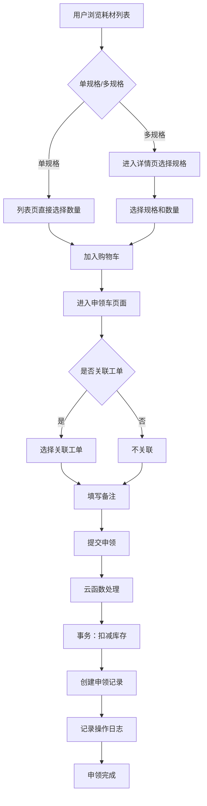
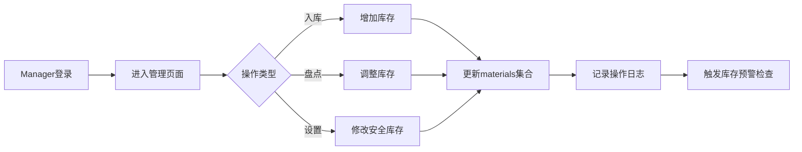
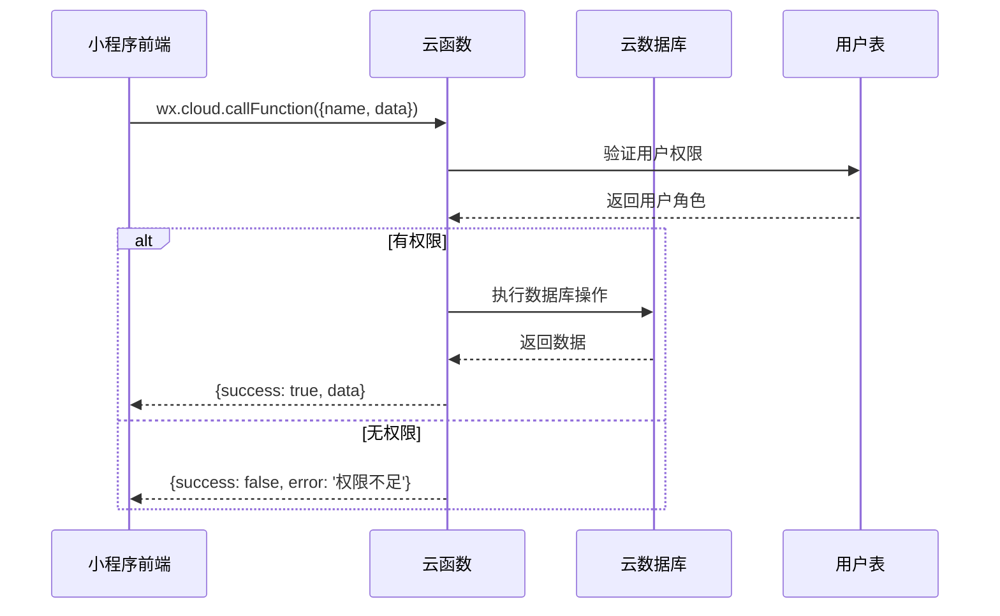

# 耗材管理系统技术文档

> 本文档详细描述耗材管理系统的业务流程、技术架构、数据库设计、云函数实现和UI设计规范

## 目录
1. [系统概述](#系统概述)
2. [业务流程](#业务流程)
3. [数据库设计](#数据库设计)
4. [云函数架构](#云函数架构)
5. [前后端交互](#前后端交互)
6. [UI设计规范](#ui设计规范)
7. [技术实现细节](#技术实现细节)

---

## 系统概述

### 系统定位
耗材管理系统是IT工程师工作台的子模块，用于管理IT运维耗材的浏览、申领、库存管理等功能。系统采用**无审批即时扣减**模式，简化申领流程，提高效率。

### 核心特性
- **即时生效**：申领提交后立即扣减库存，无需审批
- **工单关联**：支持将耗材申领关联到具体工单，便于成本追踪
- **权限分级**：Engineer可申领，Manager可管理
- **库存预警**：自动检测库存状态，及时提醒补货

### 技术栈
- **前端**：微信小程序 + TDesign组件库
- **后端**：微信云函数（Node.js）
- **数据库**：微信云数据库（MongoDB风格）
- **存储**：微信云存储（耗材图片）

---

## 业务流程

### 1. 耗材申领流程



### 2. 库存管理流程



### 3. 权限控制流程

| 角色 | 功能权限 | 数据权限 |
|------|----------|----------|
| **User** | 无法访问耗材管理 | - |
| **Engineer** | • 浏览耗材<br>• 申领耗材<br>• 关联工单 | • 不可见价格信息<br>• 只能查看自己的申领记录 |
| **Manager** | • 所有Engineer权限<br>• 耗材CRUD<br>• 库存管理<br>• 查看报表 | • 可见所有价格<br>• 可查看所有申领记录<br>• 可导出数据 |

---

## 数据库设计

### 1. materials集合（耗材表）

```javascript
{
  _id: String,              // 自动生成的文档ID
  materialNo: String,       // 耗材编号，格式：MT+日期+序号
  name: String,             // 耗材名称
  category: String,         // 类目：paper/writing/print/clean/other
  description: String,      // 描述信息
  unit: String,            // 单位：个/盒/包/箱
  defaultImage: String,     // 默认展示图片URL
  
  // 规格数组（支持多规格）
  variants: [{
    variantId: String,      // 规格ID，格式：V+序号
    label: String,          // 规格名称，如"70g 500张/包"
    costPrice: Number,      // 成本价（Manager可见）
    salePrice: Number,      // 销售价（Manager可见）
    stock: Number,          // 当前库存
    safetyStock: Number,    // 安全库存阈值
    imageUrl: String        // 规格专属图片（可选）
  }],
  
  totalStock: Number,       // 总库存（所有规格之和）
  status: String,          // 状态：active/inactive/deleted
  
  // 审计字段
  createTime: Date,         // 创建时间
  updateTime: Date,         // 更新时间
  createdBy: String,       // 创建人openid
  updatedBy: String        // 最后修改人openid
}
```

**索引设计**：
- 主键索引：`_id`
- 复合索引：`category + status + updateTime`（用于分类查询）
- 文本索引：`name, description`（用于搜索）

### 2. requisitions集合（申领单表）

```javascript
{
  _id: String,              
  requisitionNo: String,    // 申领单号，格式：RQ+日期+序号
  
  // 申领人信息（冗余存储，提高查询效率）
  applicantOpenid: String,  
  applicantName: String,    
  department: String,       
  
  // 工单关联（可选）
  ticketId: String,         // 关联工单ID
  ticketNo: String,         // 关联工单号（冗余）
  ticketSnapshot: {         // 工单快照（防止工单变更影响）
    title: String,
    customerName: String,
    status: String
  },
  
  // 申领明细
  items: [{
    materialId: String,     
    materialNo: String,     // 冗余存储
    name: String,           // 冗余存储
    variantId: String,      
    variantLabel: String,   // 冗余存储
    quantity: Number,       
    costPrice: Number,      // 申领时的价格快照
    salePrice: Number,      
    subtotal: Number        // 小计金额
  }],
  
  // 汇总信息
  totalQuantity: Number,    
  totalAmount: Number,      // 总金额（基于销售价）
  totalCost: Number,        // 总成本（基于成本价）
  
  status: String,           // completed/cancelled
  note: String,             // 备注信息
  
  // 时间戳
  createTime: Date,
  completedTime: Date
}
```

**索引设计**：
- 主键索引：`_id`
- 复合索引：`applicantOpenid + createTime`（用于用户查询）
- 单字段索引：`ticketId`（用于工单关联查询）

### 3. material_logs集合（库存变动日志）

```javascript
{
  _id: String,
  materialId: String,       
  variantId: String,        
  type: String,             // in(入库)/out(出库)/adjust(调整)
  quantity: Number,         // 变动数量（正负数）
  beforeStock: Number,      // 变动前库存
  afterStock: Number,       // 变动后库存
  
  // 关联信息
  requisitionId: String,    // 关联申领单ID（type=out时）
  ticketId: String,         // 关联工单ID（如有）
  
  // 操作信息
  operatorOpenid: String,   
  operatorName: String,     
  reason: String,           // 变动原因
  
  createTime: Date          // 操作时间
}
```

**索引设计**：
- 复合索引：`materialId + createTime`（用于查询特定耗材的历史）

---

## 云函数架构

### 1. materialManager云函数

**职责**：处理耗材相关的所有操作

```javascript
// 云函数结构
exports.main = async (event, context) => {
  const { action } = event
  
  // 权限验证中间件
  const hasPermission = await checkPermission(context.OPENID, action)
  if (!hasPermission) {
    return { success: false, error: '权限不足' }
  }
  
  // 路由分发
  switch(action) {
    case 'list':              // 获取耗材列表
      return await listMaterials(event, context)
    case 'detail':            // 获取耗材详情
      return await getMaterialDetail(event, context)
    case 'create':            // 创建耗材（Manager）
      return await createMaterial(event, context)
    case 'update':            // 更新耗材（Manager）
      return await updateMaterial(event, context)
    case 'delete':            // 删除耗材（Manager）
      return await deleteMaterial(event, context)
    case 'updateStock':       // 更新库存（Manager）
      return await updateStock(event, context)
    case 'checkStock':        // 检查库存
      return await checkStock(event, context)
    case 'exportInventory':   // 导出库存CSV（Manager）
      return await exportInventory(event, context)
  }
}
```

**核心方法实现**：

```javascript
// list action - 获取耗材列表
async function listMaterials(event, context) {
  const { category, keyword, page = 1, pageSize = 20 } = event
  
  // 构建查询条件
  const where = { status: 'active' }
  if (category && category !== 'all') {
    where.category = category
  }
  if (keyword) {
    where.name = db.RegExp({ regexp: keyword, options: 'i' })
  }
  
  // 获取用户角色，决定是否返回价格信息
  const user = await getUserInfo(context.OPENID)
  const isManager = user.roleGroup === '经理'
  
  // 查询数据
  const result = await db.collection('materials')
    .where(where)
    .skip((page - 1) * pageSize)
    .limit(pageSize)
    .orderBy('updateTime', 'desc')
    .get()
  
  // 处理数据：非Manager过滤价格字段
  let materials = result.data
  if (!isManager) {
    materials = materials.map(m => {
      if (m.variants) {
        m.variants = m.variants.map(v => {
          const { costPrice, salePrice, ...rest } = v
          return rest
        })
      }
      return m
    })
  }
  
  return { success: true, data: { list: materials, total, hasMore } }
}
```

### 2. requisitionManager云函数

**职责**：处理申领相关操作，核心是事务处理

```javascript
// submit action - 提交申领（事务处理）
async function submitRequisition(event, context) {
  const { items, ticketId, ticketNo, note } = event
  const openid = context.OPENID
  
  // 开始事务
  const transaction = await db.startTransaction()
  
  try {
    const requisitionNo = generateRequisitionNo()
    const processedItems = []
    
    // 1. 批量检查和扣减库存
    for (const item of items) {
      const material = await transaction.collection('materials')
        .doc(item.materialId)
        .get()
      
      const variant = material.variants.find(v => 
        v.variantId === item.variantId
      )
      
      // 检查库存
      if (variant.stock < item.quantity) {
        throw new Error(`库存不足: ${material.name}`)
      }
      
      // 扣减库存
      variant.stock -= item.quantity
      await transaction.collection('materials')
        .doc(item.materialId)
        .update({
          data: {
            variants: material.variants,
            totalStock: material.variants.reduce((sum, v) => 
              sum + v.stock, 0
            ),
            updateTime: db.serverDate()
          }
        })
      
      // 2. 记录库存变动日志
      await transaction.collection('material_logs').add({
        data: {
          materialId: item.materialId,
          variantId: item.variantId,
          type: 'out',
          quantity: -item.quantity,
          beforeStock: variant.stock + item.quantity,
          afterStock: variant.stock,
          requisitionId: requisitionNo,
          ticketId: ticketId || '',
          operatorOpenid: openid,
          operatorName: user.nickName,
          reason: `申领出库 ${requisitionNo}`,
          createTime: db.serverDate()
        }
      })
      
      processedItems.push({
        ...item,
        costPrice: variant.costPrice,
        salePrice: variant.salePrice,
        subtotal: variant.salePrice * item.quantity
      })
    }
    
    // 3. 创建申领单
    await transaction.collection('requisitions').add({
      data: {
        requisitionNo,
        applicantOpenid: openid,
        applicantName: user.nickName,
        department: user.department || '',
        ticketId: ticketId || '',
        ticketNo: ticketNo || '',
        items: processedItems,
        totalQuantity: processedItems.reduce((sum, item) => 
          sum + item.quantity, 0
        ),
        totalAmount: processedItems.reduce((sum, item) => 
          sum + item.subtotal, 0
        ),
        status: 'completed',
        note: note || '',
        createTime: db.serverDate(),
        completedTime: db.serverDate()
      }
    })
    
    // 提交事务
    await transaction.commit()
    
    return {
      success: true,
      data: { requisitionNo }
    }
    
  } catch (error) {
    // 回滚事务
    await transaction.rollback()
    return {
      success: false,
      error: error.message
    }
  }
}
```

### 3. 云函数通信流程



---

## 前后端交互

### 1. 数据加载策略

#### 分页加载
```javascript
// 前端请求
wx.cloud.callFunction({
  name: 'materialManager',
  data: {
    action: 'list',
    category: 'paper',
    page: 1,
    pageSize: 20
  }
})

// 云函数响应
{
  success: true,
  data: {
    list: [...],     // 耗材列表
    total: 100,      // 总数
    hasMore: true    // 是否有更多
  }
}
```

#### 实时库存校验
```javascript
// 提交前检查库存
wx.cloud.callFunction({
  name: 'materialManager',
  data: {
    action: 'checkStock',
    items: [
      { materialId: 'xxx', variantId: 'V001', quantity: 5 }
    ]
  }
})
```

### 2. 本地缓存策略

#### 购物车存储
```javascript
// 存储结构
const cart = {
  'materialId_variantId': {
    materialId: 'xxx',
    materialNo: 'MT001',
    materialName: 'A4纸',
    variantId: 'V001',
    variantLabel: '70g 500张',
    quantity: 2,
    stock: 100,
    unit: '包',
    image: 'url',
    salePrice: 25.00  // Manager可见
  }
}

// 存储到本地
wx.setStorageSync('materialCart', cart)
```

#### 用户信息缓存
```javascript
// 登录后存储
wx.setStorageSync('userInfo', {
  openid: 'xxx',
  nickName: '张三',
  roleGroup: '工程师',
  department: 'IT部'
})
```

### 3. 错误处理机制

```javascript
// 统一错误处理
async function apiCall(functionName, data) {
  try {
    wx.showLoading({ title: '加载中...' })
    
    const res = await wx.cloud.callFunction({
      name: functionName,
      data
    })
    
    if (res.result.success) {
      return res.result.data
    } else {
      throw new Error(res.result.error)
    }
    
  } catch (error) {
    console.error(`[${functionName}] 调用失败:`, error)
    
    // 用户友好的错误提示
    const errorMessages = {
      '库存不足': '所选耗材库存不足，请减少数量',
      '权限不足': '您没有权限执行此操作',
      'Network Error': '网络连接失败，请检查网络'
    }
    
    wx.showToast({
      title: errorMessages[error.message] || '操作失败',
      icon: 'none'
    })
    
    throw error
    
  } finally {
    wx.hideLoading()
  }
}
```

---

## UI设计规范

### 1. 设计原则

#### 视觉层级
- **主色调**：`#0052d9`（TDesign蓝）
- **成功色**：`#00a870`（绿色）
- **警告色**：`#ff9800`（橙色）
- **危险色**：`#ff4444`（红色）
- **背景色**：`#f5f5f5`（浅灰）

#### 间距规范
```css
/* 基础间距单位：8rpx */
--spacing-xs: 8rpx;    /* 极小间距 */
--spacing-sm: 16rpx;   /* 小间距 */
--spacing-md: 24rpx;   /* 中等间距 */
--spacing-lg: 32rpx;   /* 大间距 */
--spacing-xl: 48rpx;   /* 特大间距 */
```

#### 字体规范
```css
/* 字体大小 */
--font-xs: 22rpx;      /* 辅助信息 */
--font-sm: 24rpx;      /* 次要信息 */
--font-md: 28rpx;      /* 正文 */
--font-lg: 32rpx;      /* 标题 */
--font-xl: 36rpx;      /* 大标题 */
```

### 2. 组件设计

#### 导航栏
```css
/* 自定义导航栏 */
.navbar {
  position: fixed;
  background: white;
  padding-top: env(safe-area-inset-top);
  height: 88rpx;
  box-shadow: 0 2rpx 8rpx rgba(0,0,0,0.04);
}
```

#### 卡片组件
```css
/* 产品卡片 */
.product-card {
  background: white;
  border-radius: 16rpx;
  padding: 24rpx;
  box-shadow: 0 4rpx 12rpx rgba(0,0,0,0.04);
}

/* 库存预警边框 */
.product-card.warning {
  border-left: 6rpx solid #ff9800;
}
```

#### 按钮样式
```css
/* 主按钮 - 渐变背景 */
.btn-primary {
  background: linear-gradient(135deg, #0052d9 0%, #0066ff 100%);
  color: white;
  border-radius: 44rpx;
  height: 88rpx;
}

/* 次要按钮 - 描边 */
.btn-secondary {
  background: white;
  border: 2rpx solid #0052d9;
  color: #0052d9;
}
```

#### 步进器组件
```css
/* 数量步进器 */
.quantity-stepper {
  display: flex;
  align-items: center;
  gap: 16rpx;
}

.stepper-btn {
  width: 48rpx;
  height: 48rpx;
  border-radius: 50%;
  background: #f5f5f5;
}

.stepper-btn.plus {
  background: #e6f4ff;  /* 浅蓝色背景 */
}
```

### 3. 交互设计

#### 加载状态
- 页面加载：全屏Loading
- 按钮操作：按钮内Loading
- 列表加载：底部Loading

#### 反馈机制
- 成功操作：Toast + 震动
- 错误提示：Modal对话框
- 库存预警：橙色边框 + 文字提示

#### 动画效果
```css
/* 过渡动画 */
.transition-all {
  transition: all 0.3s ease;
}

/* 按压效果 */
.btn:active {
  transform: scale(0.98);
  opacity: 0.9;
}

/* 滑入动画 */
@keyframes slideUp {
  from {
    transform: translateY(100%);
    opacity: 0;
  }
  to {
    transform: translateY(0);
    opacity: 1;
  }
}
```

### 4. 响应式布局

#### 网格系统
```css
/* 两列布局 */
.grid-2 {
  display: grid;
  grid-template-columns: repeat(2, 1fr);
  gap: 20rpx;
}

/* Flex布局 */
.flex-between {
  display: flex;
  justify-content: space-between;
  align-items: center;
}
```

#### 适配方案
- 使用rpx单位自适应
- Safe Area适配
- 固定元素使用env()

---

## 技术实现细节

### 1. 事务处理保证数据一致性

```javascript
// 使用数据库事务确保原子性操作
const transaction = await db.startTransaction()

try {
  // 多个数据库操作
  await transaction.collection('materials').doc(id).update(...)
  await transaction.collection('material_logs').add(...)
  await transaction.collection('requisitions').add(...)
  
  // 全部成功，提交事务
  await transaction.commit()
} catch (error) {
  // 任一失败，回滚事务
  await transaction.rollback()
  throw error
}
```

### 2. 防抖节流优化性能

```javascript
// 防抖函数 - 用于搜索
function debounce(fn, delay = 300) {
  let timer = null
  return function(...args) {
    clearTimeout(timer)
    timer = setTimeout(() => {
      fn.apply(this, args)
    }, delay)
  }
}

// 节流函数 - 用于步进器
function throttle(fn, delay = 100) {
  let lastTime = 0
  return function(...args) {
    const now = Date.now()
    if (now - lastTime >= delay) {
      lastTime = now
      fn.apply(this, args)
    }
  }
}
```

### 3. 图片优化策略

```javascript
// 图片压缩上传
async function uploadImage(filePath) {
  // 1. 压缩图片
  const compressResult = await wx.compressImage({
    src: filePath,
    quality: 80
  })
  
  // 2. 上传到云存储
  const uploadResult = await wx.cloud.uploadFile({
    cloudPath: `materials/${Date.now()}.jpg`,
    filePath: compressResult.tempFilePath
  })
  
  return uploadResult.fileID
}

// 图片懒加载
<image 
  lazy-load
  mode="aspectFill"
  src="{{item.image}}"
  default-src="/assets/placeholder.png"
/>
```

### 4. 权限验证中间件

```javascript
// 云函数权限中间件
async function checkPermission(openid, action) {
  // 获取用户信息
  const user = await db.collection('users')
    .where({ openid })
    .get()
  
  if (!user.data.length) return false
  
  const roleGroup = user.data[0].roleGroup
  
  // 权限矩阵
  const permissions = {
    'User': [],
    'Engineer': ['list', 'detail', 'checkStock'],
    'Manager': ['*']  // 所有权限
  }
  
  // Manager有所有权限
  if (roleGroup === 'Manager' || roleGroup === '经理') {
    return true
  }
  
  // 检查具体权限
  const allowedActions = permissions[roleGroup] || []
  return allowedActions.includes(action)
}
```

### 5. 数据安全措施

#### 敏感数据过滤
```javascript
// 根据用户角色过滤数据
function filterSensitiveData(data, userRole) {
  if (userRole !== 'Manager') {
    // 过滤价格信息
    delete data.costPrice
    delete data.salePrice
    delete data.totalAmount
  }
  return data
}
```

#### 输入验证
```javascript
// 数量验证
function validateQuantity(quantity, maxStock) {
  if (!Number.isInteger(quantity)) {
    throw new Error('数量必须为整数')
  }
  if (quantity <= 0) {
    throw new Error('数量必须大于0')
  }
  if (quantity > maxStock) {
    throw new Error(`数量不能超过库存${maxStock}`)
  }
  return true
}
```

---

## 部署与监控

### 1. 云函数部署

```bash
# 使用微信开发者工具部署
1. 右键点击云函数文件夹
2. 选择"上传并部署：云端安装依赖"
3. 等待部署完成
```

### 2. 数据库索引创建

```javascript
// 创建索引脚本
db.collection('materials').createIndex({
  keys: {
    category: 1,
    status: 1,
    updateTime: -1
  },
  name: 'category_status_time'
})
```

### 3. 监控指标

- **系统指标**
  - 云函数调用次数
  - 响应时间
  - 错误率
  
- **业务指标**
  - 日申领量
  - 库存周转率
  - 热门耗材排行

### 4. 告警规则

- 库存低于安全值：发送消息提醒
- 申领失败率超过5%：记录日志
- 云函数超时：优化查询

---

## 最佳实践

### 1. 代码组织
```
/miniprogram
  /pages            # 页面文件
  /components       # 公共组件
  /utils           # 工具函数
  /config          # 配置文件
  
/cloudfunctions
  /materialManager  # 耗材管理
    /actions       # 各action实现
    /utils         # 工具函数
  /requisitionManager # 申领管理
```

### 2. 命名规范
- 页面文件：kebab-case（material-list）
- 云函数：camelCase（materialManager）
- 数据库集合：snake_case（material_logs）
- 变量函数：camelCase

### 3. 注释规范
```javascript
/**
 * 提交申领单
 * @param {Array} items - 申领项列表
 * @param {String} ticketId - 关联工单ID（可选）
 * @param {String} note - 备注信息
 * @returns {Promise} 申领结果
 */
async function submitRequisition(items, ticketId, note) {
  // 实现代码
}
```

### 4. 错误处理
- 使用try-catch包裹异步操作
- 提供用户友好的错误提示
- 记录详细的错误日志

---

## 总结

耗材管理系统通过合理的架构设计、严格的权限控制、可靠的事务处理，实现了高效的耗材申领流程。系统的核心优势在于：

1. **简化流程**：无审批即时生效，提高效率
2. **数据一致性**：事务处理保证库存准确
3. **用户体验**：流畅的交互和清晰的视觉设计
4. **可扩展性**：模块化设计便于功能扩展

未来可以考虑增加：
- 智能补货建议
- 耗材使用分析报表
- 批量申领模板
- 供应商管理

---

*文档版本：1.0*  
*创建日期：2025-01-20*  
*作者：开发团队*