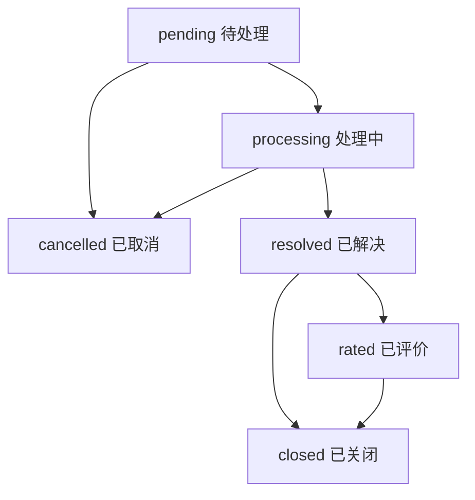

# 数据库兼容性分析和迁移指南

## 📋 概述

基于现有数据库结构分析，工程师端系统完全兼容现有的用户端小程序数据格式，采用**渐进式扩展**策略，确保数据重用性和系统稳定性。

---

## 🗄️ 现有数据库结构分析

### 1. 核心集合结构

#### 1.1 users 集合（现有）
```javascript
{
  "_id": "MongoDB ObjectId",
  "openid": "微信openid",              // ✅ 主键字段
  "unionid": "微信unionid",            // ✅ 跨应用标识
  "name": "用户姓名",                  // ✅ 用户姓名
  "avatar": "头像URL",                 // ✅ 用户头像
  "employeeId": "员工编号",            // ✅ 员工ID
  "company": "公司名称",               // ✅ 公司信息
  "department": "部门名称",            // ✅ 部门信息
  "phone": "联系电话",                 // ✅ 电话号码
  "email": "邮箱地址",                 // ✅ 邮箱
  "roleGroup": "角色组",               // ✅ 角色组分类
  "role": "具体角色",                  // ✅ 用户角色：user/engineer/manager
  "createTime": "创建时间",            // ✅ 创建时间
  "updateTime": "更新时间"             // ✅ 更新时间
}
```

#### 1.2 tickets 集合（现有）
```javascript
{
  "_id": "MongoDB ObjectId",
  "ticketNo": "工单号",                // ✅ 格式：TK + YYYYMMDD + 6位时间戳
  "title": "问题标题",                 // ✅ 工单标题
  "company": "提交单位",               // ✅ 用户单位
  "department": "提交部门",            // ✅ 用户部门
  "phone": "联系电话",                 // ✅ 联系方式
  "location": "具体位置",              // ✅ 问题位置
  "category": "问题类型",              // ✅ 问题分类
  "description": "问题描述",           // ✅ 详细描述
  "attachments": [                    // ✅ 附件数组
    {
      "id": "文件ID",
      "name": "文件名",
      "cloudPath": "云存储路径",
      "type": "文件类型",
      "size": "文件大小",
      "uploadTime": "上传时间"
    }
  ],
  "status": "工单状态",                // ✅ pending/processing/resolved/rated/cancelled/closed
  "cancelReason": "取消原因",          // ✅ 取消时的原因
  "openid": "提交者openid",            // ✅ 工单所有者
  "createTime": "创建时间",            // ✅ 提交时间
  "updateTime": "更新时间"             // ✅ 最后更新时间
}
```

---

## 🔄 工程师端扩展策略

### 1. 向后兼容的字段扩展

#### 1.1 users 集合扩展（可选字段）
```javascript
{
  // ... 所有现有字段保持不变 ...
  
  // 🆕 工程师端可选扩展字段
  "skills": ["网络", "硬件", "软件"],   // 技能标签数组
  "workload": 3,                      // 当前工作负载（工单数）
  "isActive": true,                   // 是否在职状态
  "lastActiveTime": "最后活跃时间"     // 最后登录时间
}
```

#### 1.2 tickets 集合扩展（可选字段）
```javascript
{
  // ... 所有现有字段保持不变 ...
  
  // 🆕 工程师端扩展字段
  "assignedTo": "工程师openid",        // 分配目标工程师
  "assignedBy": "管理员openid",        // 执行分配的管理员
  "assignTime": "分配时间",            // 工单分配时间
  "startTime": "开始处理时间",         // 工程师开始处理时间
  "completeTime": "完成时间",          // 工单完成时间
  "solution": "解决方案描述",          // 解决方案文字说明
  "solutions": [                      // 解决方案文件（复用attachments结构）
    {
      "id": "sol_timestamp",
      "engineerId": "工程师openid",
      "engineerName": "工程师姓名",
      "files": [...],                 // 文件列表
      "description": "解决方案说明",
      "createTime": "创建时间"
    }
  ],
  "priority": "medium",               // 优先级：low/medium/high/urgent
  "estimatedTime": 120,               // 预估处理时间（分钟）
  "actualTime": 90,                   // 实际处理时间（分钟）
  "engineerNotes": "内部备注"          // 工程师内部备注
}
```

### 2. 新增专用集合

#### 2.1 worklog 集合（工作日志）
```javascript
{
  "_id": "MongoDB ObjectId",
  "_openid": "工程师openid",           // 操作工程师身份
  "ticketId": "关联工单ID",            // 关联的工单
  "action": "complete",               // 操作类型：complete/pause/record
  "description": "操作说明",           // 操作描述
  "timeSpent": 120,                   // 本次耗时（分钟）
  "materialsUsed": [                  // 使用的耗材列表
    {
      "materialName": "网线",          // 耗材名称
      "quantity": 3,                  // 使用数量
      "unit": "米",                   // 计量单位
      "category": "网络",             // 耗材分类
      "notes": "更换损坏线缆"          // 使用备注
    }
  ],
  "createTime": "记录时间"             // 日志记录时间
}
```

#### 2.2 materials 集合（耗材清单）
```javascript
{
  "_id": "MongoDB ObjectId",
  "materialName": "网线",              // 耗材名称
  "unit": "米",                       // 标准计量单位
  "category": "网络",                 // 耗材分类
  "isActive": true,                   // 是否启用状态
  "createTime": "创建时间",            // 添加时间
  "updateTime": "更新时间"             // 最后更新时间
}
```

---

## 📊 数据兼容性保证

### 1. 字段命名兼容性

| 现有字段 | 工程师端使用 | 兼容性 | 说明 |
|---------|-------------|--------|------|
| `openid` | ✅ 直接使用 | 100% | 用户身份标识 |
| `name` | ✅ 直接使用 | 100% | 用户姓名显示 |
| `role` | ✅ 直接使用 | 100% | 角色权限控制 |
| `company` | ✅ 直接使用 | 100% | 工单显示信息 |
| `department` | ✅ 直接使用 | 100% | 工单显示信息 |
| `status` | ✅ 直接使用 | 100% | 工单状态管理 |
| `attachments` | ✅ 直接使用 | 100% | 文件附件系统 |

### 2. 状态流转兼容性



**现有状态保持不变**：
- `pending` → `processing` （分配并开始处理）
- `processing` → `resolved` （工程师完成）
- `resolved` → `rated` （用户评价）
- `resolved` → `closed` （用户确认关闭）
- 所有状态 → `cancelled` （用户或管理员取消）

### 3. 权限系统兼容性

```javascript
// 现有权限配置保持不变
const rolePermissions = {
  'user': {
    tickets: ['read:own', 'create', 'update:own', 'cancel:own'],
    users: ['read:own', 'update:own']
  },
  'engineer': {
    tickets: ['read:assigned', 'update:assigned', 'process'],
    users: ['read:own', 'update:own'],
    worklog: ['create', 'read:own'],
    materials: ['read', 'use']
  },
  'manager': {
    tickets: ['read:all', 'assign', 'reassign', 'close'],
    users: ['read:team', 'update:team'],
    worklog: ['read:all'],
    materials: ['read', 'manage']
  }
}
```

---

## 🚀 数据迁移策略

### 1. 零停机迁移方案

#### 阶段1：添加扩展字段（不影响现有功能）
```javascript
// 为现有用户添加role字段（如果没有）
db.collection('users').where({
  role: db.command.not(db.command.exists())
}).update({
  data: {
    role: 'user',  // 默认为普通用户
    updateTime: new Date()
  }
})

// 为现有工单添加优先级（如果没有）
db.collection('tickets').where({
  priority: db.command.not(db.command.exists())
}).update({
  data: {
    priority: 'medium',  // 默认中等优先级
    updateTime: new Date()
  }
})
```

#### 阶段2：创建新集合
```javascript
// 创建工作日志集合
db.createCollection('worklog')

// 创建耗材清单集合并初始化常用耗材
db.collection('materials').add([
  { materialName: '网线', unit: '米', category: '网络', isActive: true },
  { materialName: '打印纸', unit: '包', category: '办公', isActive: true },
  { materialName: '墨盒', unit: '个', category: '办公', isActive: true },
  { materialName: '螺丝包', unit: '套', category: '硬件', isActive: true },
  { materialName: '电源线', unit: '根', category: '硬件', isActive: true }
])
```

#### 阶段3：设置数据库索引
```javascript
// 优化查询性能的索引
db.collection('tickets').createIndex({ "assignedTo": 1, "status": 1 })
db.collection('tickets').createIndex({ "status": 1, "createTime": -1 })
db.collection('worklog').createIndex({ "_openid": 1, "createTime": -1 })
db.collection('users').createIndex({ "role": 1, "isActive": 1 })
```

### 2. 数据验证和回滚

#### 验证脚本
```javascript
// 验证数据完整性
async function validateDataIntegrity() {
  // 检查用户role字段
  const usersWithoutRole = await db.collection('users')
    .where({ role: db.command.not(db.command.exists()) })
    .count()
  
  console.log(`发现 ${usersWithoutRole.total} 个用户缺少role字段`)
  
  // 检查工单状态有效性
  const invalidStatusTickets = await db.collection('tickets')
    .where({ 
      status: db.command.not(db.command.in([
        'pending', 'processing', 'resolved', 'rated', 'cancelled', 'closed'
      ])) 
    })
    .count()
  
  console.log(`发现 ${invalidStatusTickets.total} 个工单状态异常`)
}
```

#### 回滚方案
```javascript
// 如需回滚，删除扩展字段
async function rollbackExtensions() {
  // 删除扩展字段
  await db.collection('users').update({
    data: {
      skills: db.command.remove(),
      workload: db.command.remove(),
      isActive: db.command.remove()
    }
  })
  
  await db.collection('tickets').update({
    data: {
      assignedTo: db.command.remove(),
      assignedBy: db.command.remove(),
      priority: db.command.remove()
    }
  })
}
```

---

## 🔧 API兼容性保证

### 1. 现有API保持不变

```javascript
// ✅ 现有submitTicket云函数的所有action保持完全兼容
const existingActions = [
  'submit',      // 提交工单
  'list',        // 获取工单列表  
  'detail',      // 获取工单详情
  'update',      // 更新工单
  'updateStatus' // 更新工单状态
]

// ✅ 响应格式保持一致
{
  "code": 200,
  "message": "操作成功",
  "data": { /* 数据内容 */ }
}
```

### 2. 工程师端API扩展

```javascript
// 🆕 工程师端新增action（不影响现有功能）
const engineerActions = [
  'assign',          // 分配工单（经理）
  'listForEngineer', // 工程师工单列表
  'listForManager',  // 经理工单列表
  'startProcess',    // 开始处理
  'completeTicket'   // 完成工单
]
```

---

## 📈 性能优化策略

### 1. 查询优化

```javascript
// 高频查询的索引优化
const indexes = [
  // 用户端现有查询
  { "openid": 1, "createTime": -1 },      // 用户工单列表
  { "status": 1, "createTime": -1 },       // 状态筛选
  
  // 工程师端新增查询
  { "assignedTo": 1, "status": 1 },        // 工程师工单列表
  { "status": 1, "priority": 1 },          // 优先级排序
  { "_openid": 1, "createTime": -1 }       // 工作日志查询
]
```

### 2. 数据分页策略

```javascript
// 统一的分页参数
const paginationDefaults = {
  page: 1,          // 页码（从1开始）
  limit: 20,        // 每页数量
  maxLimit: 100     // 最大每页数量限制
}
```

---

## 🛡️ 数据安全保证

### 1. 权限隔离

```javascript
// 数据库权限配置
const dbRules = {
  "read": {
    "tickets": "resource.openid == auth.openid || auth.role == 'manager'",
    "users": "resource.openid == auth.openid || auth.role == 'manager'",
    "worklog": "resource._openid == auth.openid || auth.role == 'manager'"
  },
  "write": {
    "tickets": "resource.openid == auth.openid && resource.status == 'pending'",
    "users": "resource.openid == auth.openid",
    "worklog": "auth.role in ['engineer', 'manager']"
  }
}
```

### 2. 数据验证

```javascript
// 统一的数据验证规则
const validationRules = {
  tickets: {
    title: { required: true, maxLength: 100 },
    company: { required: true, maxLength: 50 },
    status: { 
      enum: ['pending', 'processing', 'resolved', 'rated', 'cancelled', 'closed'] 
    }
  },
  users: {
    name: { required: true, maxLength: 20 },
    role: { enum: ['user', 'engineer', 'manager'] }
  }
}
```

---

## ✅ 兼容性测试清单

### 1. 功能兼容性测试

- [ ] 用户端提交工单功能正常
- [ ] 用户端查看工单列表正常
- [ ] 用户端更新工单信息正常
- [ ] 用户端取消工单功能正常
- [ ] 现有工单状态流转正常

### 2. 数据兼容性测试

- [ ] 现有用户数据读取正常
- [ ] 现有工单数据显示正常
- [ ] 新增字段不影响现有功能
- [ ] 数据库查询性能正常
- [ ] 权限验证功能正常

### 3. API兼容性测试

- [ ] 所有现有API响应格式一致
- [ ] 现有错误处理机制正常
- [ ] 新增API不影响现有功能
- [ ] 云函数版本兼容性正常

---

## 📋 部署检查清单

### 1. 部署前准备

- [ ] 备份现有数据库
- [ ] 验证扩展字段设计
- [ ] 准备回滚方案
- [ ] 测试环境验证完成

### 2. 部署步骤

- [ ] 添加新字段默认值
- [ ] 创建新集合和索引
- [ ] 部署新云函数
- [ ] 验证数据完整性
- [ ] 性能监控检查

### 3. 部署后验证

- [ ] 现有功能完全正常
- [ ] 新增功能正常运行
- [ ] 数据同步正确
- [ ] 性能指标正常
- [ ] 错误日志检查

这个兼容性方案确保工程师端系统能够与现有用户端小程序完美集成，实现数据的100%重用性，同时为系统扩展提供坚实基础。