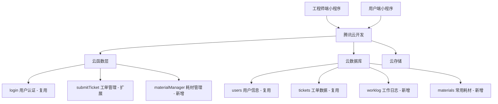
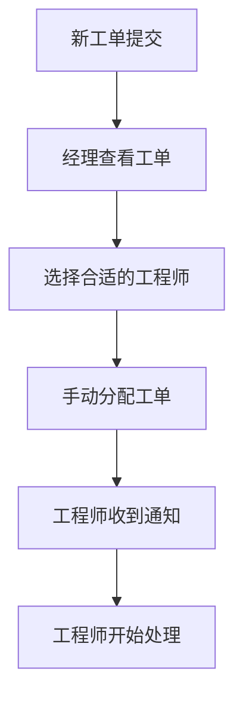
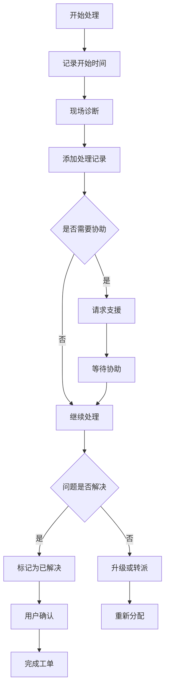
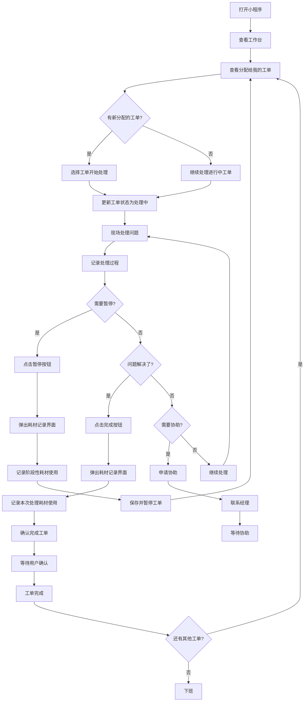
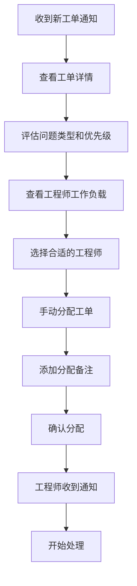
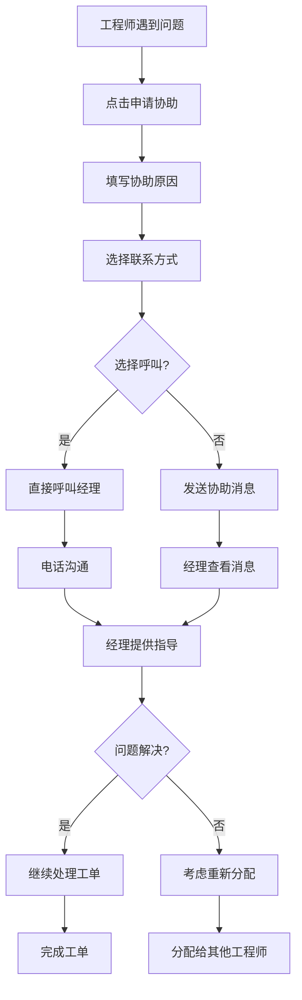
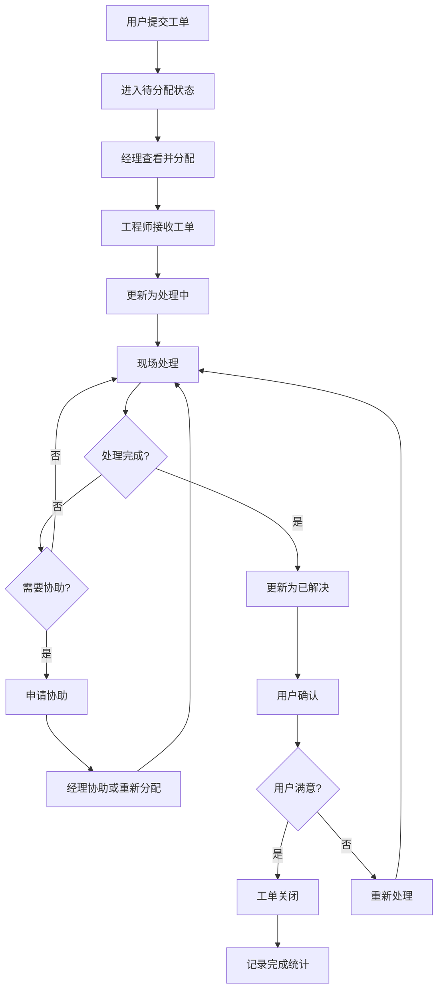

# 工程师端小程序功能设计文档

## 📋 项目概述

基于现有的用户端工单管理系统，设计一个简化的工程师端小程序，为IT技术支持团队提供基础的工单处理和耗材记录功能。

### 🎯 设计目标

1. **快速上线**：功能简单实用，易于开发和维护
2. **工单处理**：高效处理分配的工单，记录处理过程
3. **耗材管理**：简单记录耗材使用，便于统计
4. **移动优先**：随时随地处理工单和记录耗材

---

## 🎭 用户角色体系

### 角色定义

#### 1. 工程师 (Engineer)
- **权限**：处理工单，记录耗材使用，查看个人统计
- **职责**：技术支持，问题解决，耗材记录
- **工作特点**：现场服务为主

#### 2. IT经理 (Manager)
- **权限**：所有工单管理 + 工程师管理 + 数据查看
- **职责**：工单分配，团队管理，成本控制
- **工作特点**：管理导向，全局把控

---

## 🏗️ 系统架构设计

### 技术架构



### 数据库扩展设计

#### 复用现有集合

##### 1. users - 用户信息（复用现有集合）
基于现有的users集合结构，确保完全兼容：
```javascript
{
  _id: ObjectId,
  openid: String,               // 微信openid（现有字段）
  unionid: String,              // 微信unionid（现有字段，可选）
  name: String,                 // 用户姓名/昵称（现有字段）
  avatar: String,               // 用户头像（现有字段）
  employeeId: String,           // 员工编号（现有字段）
  company: String,              // 公司名称（现有字段）
  department: String,           // 部门（现有字段）
  phone: String,                // 电话（现有字段）
  email: String,                // 邮箱（现有字段）
  roleGroup: String,            // 角色组（现有字段）：用户/工程师/管理员
  role: String,                 // 具体角色（现有字段）：user/engineer/manager
  createTime: Date,             // 创建时间（现有字段）
  updateTime: Date,             // 更新时间（现有字段）
  
  // 工程师端可选扩展字段
  skills: Array,                // 技能标签：["网络", "硬件", "软件"]
  workload: Number,             // 当前工作负载（工单数量）
  isActive: Boolean             // 是否在职
}
```

##### 2. tickets - 工单数据（复用现有集合）
基于现有tickets集合结构，确保完全兼容：
```javascript
{
  _id: ObjectId,
  ticketNo: String,             // 工单号（现有字段）：TK + YYYYMMDD + 6位时间戳
  title: String,                // 问题标题（现有字段）
  company: String,              // 提交者单位（现有字段）
  department: String,           // 提交者部门（现有字段）
  phone: String,                // 联系电话（现有字段）
  location: String,             // 具体位置（现有字段）
  category: String,             // 问题类型（现有字段）
  description: String,          // 问题描述（现有字段）
  attachments: Array,           // 附件数组（现有字段）
  status: String,               // 工单状态（现有字段）：pending/processing/resolved/rated/cancelled/closed
  cancelReason: String,         // 取消原因（现有字段）
  openid: String,               // 提交者openid（现有字段）
  createTime: Date,             // 创建时间（现有字段）
  updateTime: Date,             // 更新时间（现有字段）
  
  // 工程师端扩展字段（向现有系统添加）
  assignedTo: String,           // 分配给的工程师openid
  assignedBy: String,           // 分配者openid
  assignTime: Date,             // 分配时间
  startTime: Date,              // 开始处理时间
  completeTime: Date,           // 完成时间
  solution: String,             // 解决方案描述
  solutions: Array,             // 解决方案文件（与现有attachments结构兼容）
  priority: String,             // 优先级：low/medium/high/urgent
  estimatedTime: Number,        // 预估处理时间（分钟）
  actualTime: Number,           // 实际处理时间（分钟）
  engineerNotes: String         // 工程师内部备注
}
```

#### 新增集合

##### 3. worklog - 工作日志（新增）
```javascript
{
  _id: ObjectId,
  _openid: String,              // 工程师openid
  ticketId: String,             // 相关工单ID
  action: String,               // 'pause', 'complete', 'record'
  description: String,          // 工作描述
  timeSpent: Number,            // 耗时(分钟)
  
  // 耗材使用记录
  materialsUsed: [
    {
      materialName: String,     // 耗材名称：网线、打印纸、墨盒等
      quantity: Number,         // 使用数量
      unit: String,             // 单位：米、张、个等
      notes: String             // 备注说明
    }
  ],
  
  createTime: Date
}
```

##### 4. materials - 常用耗材清单（新增）
```javascript
{
  _id: ObjectId,
  materialName: String,         // 耗材名称：网线、打印纸、墨盒等
  unit: String,                 // 单位：米、张、个等
  category: String,             // 分类：网络、办公、硬件
  isActive: Boolean,            // 是否启用
  createTime: Date
}
```

---

## 📱 功能模块设计

### 1. 工作台首页 (Dashboard)

#### 页面布局
```
┌─────────────────────────────────┐
│  👤 张工程师 | 在线 | 工作量: 5/10 │
│  📍 行政楼2楼 | ⚙️ 设置           │
├─────────────────────────────────┤
│           今日工作概览            │
│  ┌─────┐ ┌─────┐ ┌─────┐ ┌─────┐ │
│  │  3  │ │  5  │ │  2  │ │  1  │ │
│  │待处理│ │进行中│ │已完成│ │紧急 │ │
│  └─────┘ └─────┘ └─────┘ └─────┘ │
├─────────────────────────────────┤
│            快捷操作              │
│  📋 我的工单 | 📦 耗材管理        │
│  📞 呼叫经理 | 📊 工作统计        │
├─────────────────────────────────┤
│           最新工单 (查看全部)      │
│  ┌─ #TK001215 ────────────────┐  │
│  │ 🔴 电脑无法开机               │
│  │ 📍 研发部A区 | ⏰ 2小时前     │
│  │ 👤 张三 | 📞 138****8000     │
│  └─ [查看] [开始处理] ──────────┘  │
└─────────────────────────────────┘
```

#### 核心功能
- **实时状态显示**：在线状态、当前工作负载
- **数据概览**：今日工单统计、处理进度、紧急工单
- **快捷操作**：工单查看、状态更新、耗材管理
- **工单处理**：查看分配给自己的工单并处理

### 2. 工单管理模块

#### 2.1 工单列表页面

##### 角色权限控制
工单列表页面根据用户角色显示不同的操作按钮：

**经理角色** (`userRole = 'manager'`)：
- 显示 "👥 分配" 按钮（未分配工单）
- 显示 "🔄 重新分配" 按钮（已分配工单）
- 点击分配按钮导航到 `ticket-assign.html` 页面

**工程师角色** (`userRole = 'engineer'`)：
- 显示 "立即处理"、"继续处理"、"开始处理" 按钮
- 只能处理分配给自己的工单

##### 筛选功能
```javascript
// 筛选条件
{
  status: ['pending', 'assigned', 'processing', 'resolved'],
  priority: ['low', 'medium', 'high', 'urgent'],
  category: ['硬件问题', '软件问题', '网络问题'],
  assignee: 'me' | 'team' | 'unassigned',
  timeRange: 'today' | 'week' | 'month',
  location: '按楼层/部门筛选',
  keyword: '关键词搜索'
}
```

##### 技术实现
```javascript
// 角色控制示例代码
const userRole = getUserRole(); // 从登录信息获取用户角色

function navigateToAssign(ticketId) {
    window.location.href = `ticket-assign.html?ticketId=${ticketId}`;
}

// 根据角色显示按钮
if (userRole === 'manager') {
    document.getElementById('assign-btn-' + ticketId).style.display = 'inline-block';
} else if (userRole === 'engineer') {
    document.getElementById('process-btn-' + ticketId).style.display = 'inline-block';
}
```

#### 2.2 工单详情页面

```
┌─────────────────────────────────┐
│ ← #TK001215 | 🔴 高优先级        │
├─────────────────────────────────┤
│ 📋 电脑无法开机                  │
│ 📅 2024-12-13 09:30             │
│ 👤 张三 | 财务部 | 📞 138****8000│
│ 📍 行政楼4楼405室                │
├─────────────────────────────────┤
│ 📝 问题描述                      │
│ 昨天下班前电脑还正常，今天来按开机│
│ 键没有反应，电源指示灯也不亮...   │
├─────────────────────────────────┤
│ 📎 附件 (2)                      │
│ 🖼️ photo1.jpg | 📄 log.txt      │
├─────────────────────────────────┤
│ 📊 状态历史                      │
│ ✅ 已提交 | 09:30 | 系统         │
│ 🔄 处理中 | 10:15 | 李工程师     │
├─────────────────────────────────┤
│ 💬 处理记录                      │
│ [添加记录] [上传图片] [语音记录]  │
├─────────────────────────────────┤
│ ⚡ 快捷操作                      │
│ [暂停处理*] [继续处理] [完成*] [申请协助] │
│ * 点击后弹出耗材记录界面          │
└─────────────────────────────────┘
```

##### 耗材弹窗功能

当工程师点击以下操作时，会自动弹出耗材记录界面：
- **完成工单**：记录本次处理使用的耗材
- **暂停处理**：记录阶段性使用的耗材
- **记录耗材**：主动记录耗材使用

**耗材弹窗界面设计**：
```
┌─────────────────────────────────┐
│ 完成工单 - 记录耗材        ✕    │
├─────────────────────────────────┤
│ 📋 #TK001215 电脑无法开机        │
│ 📍 行政楼4楼405室 | 👤 张三      │
├─────────────────────────────────┤
│ 📦 使用的耗材 (2项)              │
│ ┌─ 网线 ──────────────────────┐ │
│ │ 📦 网线                  ✕移除│ │
│ │ [3] 米                       │ │
│ └─────────────────────────────┘ │
│ ┌─ 螺丝包 ────────────────────┐ │
│ │ 📦 螺丝包                ✕移除│ │
│ │ [1] 套                       │ │
│ └─────────────────────────────┘ │
├─────────────────────────────────┤
│ 常用耗材                         │
│ [🔌网线] [🔧螺丝包] [🖨️打印纸]   │
│ [🖤墨盒] [🔌电源线] [📱数据线]   │
├─────────────────────────────────┤
│ 自定义耗材                       │
│ [耗材名称] [数量] [单位▼]        │
│ [+ 添加到清单]                   │
├─────────────────────────────────┤
│ [取消]           [完成工单]      │
└─────────────────────────────────┘
```

**技术实现要点**：
```javascript
// 弹窗控制函数
function showMaterialModal(action) {
    // action: 'complete', 'pause', 'record'
    // 根据操作类型设置界面标题和按钮文字
    switch (action) {
        case 'complete':
            title.textContent = '完成工单 - 记录耗材';
            button.textContent = '完成工单';
            button.className = 'bg-green-500 text-white';
            break;
        case 'pause':
            title.textContent = '暂停处理 - 记录耗材';
            button.textContent = '暂停并保存';
            button.className = 'bg-orange-500 text-white';
            break;
        case 'record':
            title.textContent = '记录耗材使用';
            button.textContent = '保存记录';
            button.className = 'bg-blue-500 text-white';
            break;
    }
}

// 耗材管理功能
- 快速添加常用耗材
- 自定义耗材名称、数量、单位
- 实时修改耗材数量
- 移除不需要的耗材项目
- 数据验证和保存
```

#### 2.3 工单处理流程

##### 分配流程（简化版）


##### 处理流程


### 3. 工单分配系统（经理手动分配）

#### 3.1 简单分配界面

```
┌─────────────────────────────────┐
│       工单分配                   │
├─────────────────────────────────┤
│ 工单: #TK001215 电脑无法开机     │
│ 📍 行政楼4楼 | 🔴 高优先级       │
│ 👤 张三 | 📞 138****8000         │
├─────────────────────────────────┤
│ 📝 问题描述                      │
│ 昨天下班前电脑还正常，今天开机无反应...│
├─────────────────────────────────┤
│ 👥 选择工程师                    │
│ ┌─ 李工程师 ──────────────────┐  │
│ │ 📊 当前工单: 3个              │  │
│ │ 📅 最后活跃: 10分钟前         │  │
│ │ [分配给他]                   │  │
│ └─────────────────────────────┘  │
│ ┌─ 王工程师 ──────────────────┐  │
│ │ 📊 当前工单: 5个              │  │
│ │ 📅 最后活跃: 1小时前          │  │
│ │ [分配给他]                   │  │
│ └─────────────────────────────┘  │
├─────────────────────────────────┤
│ 💬 分配备注                      │
│ [请优先处理，用户比较着急...]     │
├─────────────────────────────────┤
│ [📤 分配工单] [📋 暂不分配]       │
└─────────────────────────────────┘
```

### 4. 简单协作功能

#### 4.1 申请协助功能

```
┌─────────────────────────────────┐
│         申请协助                 │
├─────────────────────────────────┤
│ 工单: #TK001215 电脑无法开机     │
├─────────────────────────────────┤
│ 🤝 申请协助原因                  │
│ [问题比较复杂，需要协助...]       │
├─────────────────────────────────┤
│ 📞 联系方式                      │
│ • 直接呼叫经理                   │
│ • 发送微信消息                   │
│ • 留言等待回复                   │
├─────────────────────────────────┤
│ [📞 立即呼叫] [💬 发送消息]       │
└─────────────────────────────────┘
```

### 5. 耗材管理模块（简化版）

#### 5.1 耗材使用记录界面

```
┌─────────────────────────────────┐
│        工单处理 - 记录耗材        │
├─────────────────────────────────┤
│ 📋 工单: #TK001215 电脑无法开机  │
├─────────────────────────────────┤
│ 📦 使用的耗材                    │
│ ┌─────────────────────────────┐ │
│ │ 耗材名称: [网线 ▼]           │ │
│ │ 数量: [3] 米                │ │
│ │ 备注: [更换损坏连接线]       │ │
│ │ [移除]                      │ │
│ └─────────────────────────────┘ │
│ ┌─────────────────────────────┐ │
│ │ 耗材名称: [螺丝包 ▼]         │ │
│ │ 数量: [1] 套                │ │
│ │ 备注: [固定设备]             │ │
│ │ [移除]                      │ │
│ └─────────────────────────────┘ │
├─────────────────────────────────┤
│ [+ 添加耗材] [💾 保存记录]       │
└─────────────────────────────────┘
```

#### 5.2 耗材使用统计（简化版）

```
┌─────────────────────────────────┐
│        个人耗材使用统计 (本月)    │
├─────────────────────────────────┤
│ 📊 使用概览                      │
│ 使用种类: 5 种                   │
│ 工单数量: 12 个                  │
├─────────────────────────────────┤
│ 🏆 使用排行                      │
│ 1️⃣ 网线: 18米                   │
│ 2️⃣ 螺丝包: 5套                  │
│ 3️⃣ 打印纸: 2包                  │
│ 4️⃣ 墨盒: 1个                    │
└─────────────────────────────────┘
```

### 6. 简单工作记录

#### 6.1 快速记录模板

```javascript
// 简化的工作记录模板
const simpleTemplates = [
  {
    name: "硬件维修",
    commonMaterials: ["网线", "螺丝包", "网络模块"]
  },
  {
    name: "软件安装",
    commonMaterials: ["软件安装包"]
  },
  {
    name: "打印机维护",
    commonMaterials: ["墨盒", "打印纸"]
  }
];
```

### 7. 简单数据统计

#### 7.1 个人工作统计（简化版）

```
┌─────────────────────────────────┐
│      个人工作统计(本月)          │
├─────────────────────────────────┤
│ 👤 张工程师                      │
│ 📊 个人工作统计                  │
├─────────────────────────────────┤
│ 📊 工单处理情况                  │
│ 📋 处理总数: 12个                │
│ ✅ 已完成: 10个                  │
│ 🔄 进行中: 2个                   │
│ ⏱️ 平均耗时: 2.5小时             │
├─────────────────────────────────┤
│ 📦 耗材使用统计                  │
│ 🥇 网线: 18米                    │
│ 🥈 螺丝包: 5套                   │
│ 🥉 打印纸: 2包                   │
└─────────────────────────────────┘
```

**设计原则**: 
- 只显示工程师姓名和"个人工作统计"标题
- 去掉工号、部门、专业领域等详细信息
- 去掉位置、入职天数等不必要的个人信息
- 专注于工作数据和统计信息的展示
- 移除效率分析、满意度、响应时间等复杂指标
- 移除成就徽章等游戏化元素
- 保持界面简洁，只展示核心工作数据

#### 7.2 经理查看统计

```
┌─────────────────────────────────┐
│        团队工作概览              │
├─────────────────────────────────┤
│ 📊 本月统计                      │
│ 📋 总工单: 45个                  │
│ ✅ 已完成: 38个                  │
│ 👥 活跃工程师: 3人               │
├─────────────────────────────────┤
│ 🏅 工程师排行                    │
│ 1️⃣ 李工程师: 15个工单            │
│ 2️⃣ 王工程师: 12个工单            │
│ 3️⃣ 张工程师: 11个工单            │
└─────────────────────────────────┘
```

---

## 🔄 工作流程设计（简化版）

### 1. 工程师日常工作流程



**耗材记录流程说明**：
- **暂停处理时**：弹出耗材界面，记录阶段性使用的耗材，便于跟踪中间过程
- **完成工单时**：强制弹出耗材界面，确保记录完整的耗材使用情况
- **手动记录**：工程师可随时点击"记录耗材"按钮主动记录

### 2. 经理工单分配流程



### 3. 协助处理流程



### 4. 完整工单生命周期



---

## 🎨 界面设计原则

### 1. 设计理念

#### 效率优先
- **一键操作**：常用功能一键完成
- **快速导航**：不超过3层页面深度
- **简单操作**：每个工单单独处理，避免复杂的批量操作

#### 信息密度
- **关键信息突出**：优先级、状态、时间等关键信息
- **分层展示**：详细信息可展开查看
- **智能筛选**：根据角色和场景智能过滤信息

#### 移动优化
- **大按钮设计**：适合手指操作的按钮尺寸
- **单手操作**：主要功能支持单手操作
- **语音输入**：支持语音记录和输入

### 2. 颜色体系

```javascript
const engineerTheme = {
  primary: '#1890ff',      // 主色调 - 蓝色
  success: '#52c41a',      // 成功 - 绿色  
  warning: '#faad14',      // 警告 - 橙色
  error: '#f5222d',        // 错误 - 红色
  urgent: '#ff4d4f',       // 紧急 - 醒目红色
  
  status: {
    online: '#52c41a',     // 在线 - 绿色
    busy: '#faad14',       // 忙碌 - 橙色  
    offline: '#d9d9d9'     // 离线 - 灰色
  },
  
  priority: {
    low: '#52c41a',        // 低优先级 - 绿色
    medium: '#1890ff',     // 中优先级 - 蓝色
    high: '#faad14',       // 高优先级 - 橙色
    urgent: '#f5222d'      // 紧急 - 红色
  }
};
```

### 3. 图标体系

```javascript
const iconMapping = {
  // 工单状态
  pending: '⏳',
  processing: '🔄', 
  resolved: '✅',
  closed: '📋',
  
  // 优先级
  low: '🟢',
  medium: '🟡', 
  high: '🟠',
  urgent: '🔴',
  
  // 功能操作
  assign: '👥',
  transfer: '🔄',
  escalate: '⬆️',
  complete: '✅',
  
  // 工作状态
  online: '🟢',
  busy: '🟡',
  offline: '⚫'
};
```

