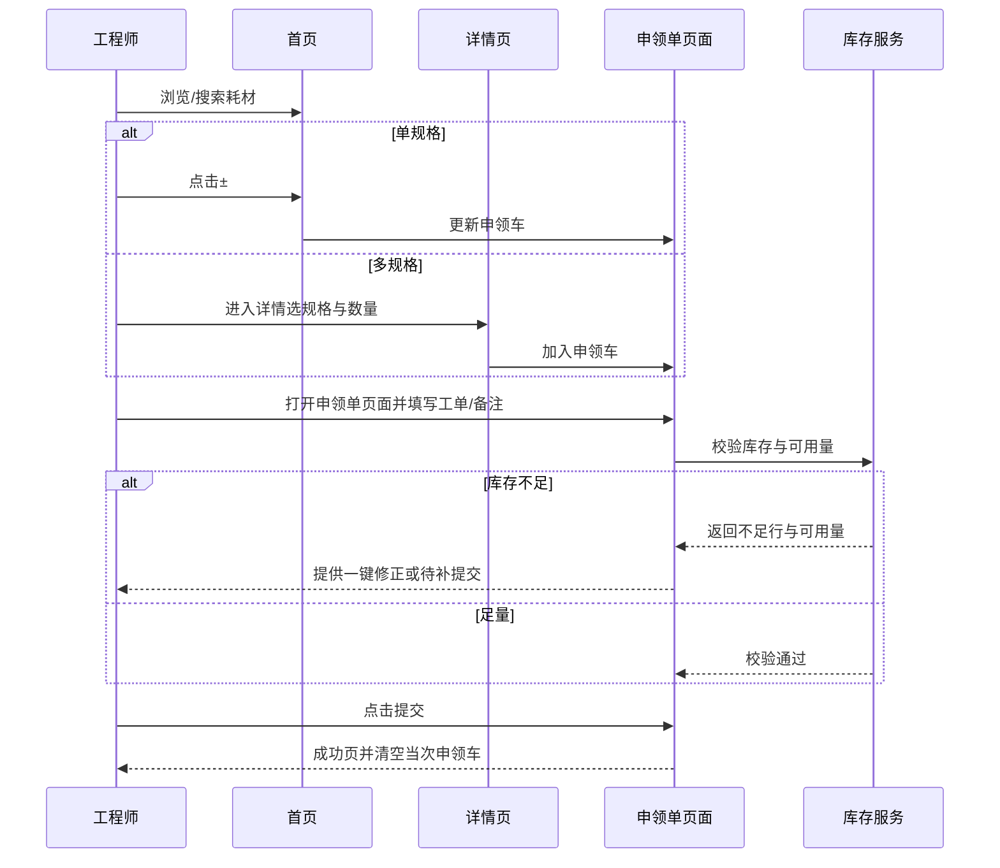

* 权限三层 User/Engineer/Manager；
* 工程师只能申领，经理可管理；
* 价格相关只经理可见；
* 新增了“申领单可绑定工单”功能；
* 照片上传规则参考头像上传策略）。

下面是 **完整修订版**：

---

# 耗材管理系统设计文档（更新：一次性申领 / 购物车模式）

## 1. 背景与目标

用于企业办公耗材的展示、搜索、规格选择、一次性申领与库存监控。**不再存在“新建申领单”入口**；采用与购物车一致的**一次性申领模式**：当前会话内选好的物品统一提交，完成后清空。

## 2. 功能需求

### 2.1 首页（耗材列表）

* 左侧类目：常用、纸张、书写、打印耗材、清洁/杂项；底部带“+ 添加耗材类型”。
* 右侧卡片：名称、副标题（规格摘要）、价格、库存状态；底部带“+ 添加耗材产品”。
* **单规格**：卡片右侧显示数量步进器（±），直接加入当前会话的申领车。
* **多规格**：显示“选规格”，点击进入**整页详情**。
* 顶部搜索入口：进入独立搜索页（借鉴 ticketlist 页面的搜索逻辑，尽量重用已验证的代码）。
* 底部吸底条：左侧显示仓库与库存策略，右侧显示**申领车汇总按钮（数量与合计）**，点击进入“申领单页面”。

### 2.2 搜索页

* 顶部输入框 + 卡片式搜索结果；交互同首页卡片（单规格直接加减，多规格进入详情）。
* 返回关闭搜索页并保留当前已选项。

### 2.3 详情页（多规格整页）

* 大图展示区：支持上传/拖拽/拍照；预览与替换；命名规则参照头像上传；图片采取替换策略，不保留旧文件。
* 基本信息：名称、库存/安全线。
* 规格选择：2–3 个 chip；切换更新价格与可用库存。

  * 工程师：仅可见库存数量。
  * 经理：可见库存 + 成本/售价。
* 数量步进器；底部“选好了”加入当次申领车。

### 2.4 申领单页面（购物车页）

> 本页为**一次性申领**的确认页，提交成功后清空当次内容。

**信息结构**：

* 顶部：返回、标题“申领单”。
* 列表：每行包含缩略图、名称、规格、库存状态、行内数量步进器与删除。
* 汇总条：物品种类数、合计数量（隐藏金额列，仅经理可见金额）。
* 领取信息：

  * 申请人（自动填充当前工程师，可编辑）
  * 可绑定工单（输入或下拉选择工单号/标题，用于追溯申领原因）
  * 备注（可选）
* 底部固定提交按钮：

  * **提交前校验**：库存是否足够；若不足：

    * 行内高亮并提示“库存不足，仅可申领 n 件”，提供一键**按可用量**修正；
    * 或允许保留数量并提交为“待补”状态（可配置）。

**交互要点**：

* 行内数量变更实时更新汇总与校验状态。
* 删除行后，若购物车为空，返回耗材管理主页面。
* 提交成功：显示结果页（编号、时间、摘要），本次申领车清空。

### 2.5 照片上传

* 详情页支持上传，最近一次上传图作为该规格的默认展示图（会话态）。
* 支持移动端调用摄像头。
* 预览区点击可重新上传；关闭详情重置预览状态。

## 3. 非功能需求

* UI 风格与现有系统保持一致。
* 移动优先；列表与详情滚动分离；吸底条减少遮挡。
* 性能：限制全局查询，使用容器选择器；虚拟滚动可选；图片懒加载。
* 安全：减少 innerHTML；对输入做转义；文件类型/大小校验。
* 可扩展：留出后端接口与权限控制挂钩。

## 4. 交互逻辑（更新）

1. 首页浏览：

   * 单规格直接±加入当次申领车；
   * 多规格进入详情选规格后加入申领车。
2. 点击底部汇总按钮进入**申领单页面**。
3. 在申领单页面进行数量微调/删除、填写领取信息并可绑定工单。
4. 校验库存 → 允许自动修正或提交为“待补”。
5. 提交成功 → 清空申领车 → 返回首页。

---

## 5. 交互流程图（更新）

```mermaid
graph TD
  首页 -->|搜索| 搜索页
  首页 -->|选规格(多规格)| 详情页
  首页 -->|±(单规格)| 申领单页面
  搜索页 -->|点击卡片| 详情页
  详情页 -->|选好了| 申领单页面
  申领单页面 -->|提交成功| 结果页 --> 首页
```

## 6. 界面原型草图（更新）

```mermaid
graph LR
  subgraph 首页
    A1[顶部搜索框]
    A2[左侧类目]
    A3[右侧卡片列表]
    A4[底部汇总按钮: 数量/合计]
  end

  subgraph 搜索页
    B1[输入框]
    B2[结果卡片]
  end

  subgraph 详情页
    C1[大图上传]
    C2[名称/库存/价格(经理可见)]
    C3[规格chip]
    C4[数量±]
    C5[选好了]
  end

  subgraph 申领单页面
    D1[行项目: 图/名/规/库存/±/删除]
    D2[汇总: 种类/数量/金额(仅经理)]
    D3[领取信息: 人/工单/备注]
    D4[库存校验&修正]
    D5[提交]
  end
```

## 7. 工程师操作时序（更新）



## 8. 数据结构设计（建议可根据我们现有的数据库信息进行集成）

```ts
// 耗材
type Item = {
  id: string
  name: string
  category: 'fav'|'paper'|'writing'|'print'|'clean'
  variants: Variant[]
  safetyMin: number
  stock: number
  thumb?: string
}

// 规格
type Variant = {
  id: string
  label: string
  price?: number       // 仅经理可见
  stock?: number
  imageUrl?: string
}

// 申领车行
type CartLine = {
  itemId: string
  variantId?: string
  name: string
  variantLabel?: string
  qty: number
  unitPrice?: number   // 仅经理可见
}

// 申领车（一次性）
type Cart = {
  lines: CartLine[]
  applicant: string
  workOrder?: string   // 新增：绑定工单号
  note?: string
}

// 库存校验返回
type InventoryCheck = {
  ok: boolean
  lines: {key:string, requested:number, available:number}[]
}
```

## 9. 校验规则与边界情况

* 行数量 ≥1；若置0即删除。
* 库存不足：提供“按可用量修正”与“待补提交”。
* 规格切换后若当前数量大于可用量，行内提示并自动降至可用量或标红等待处理。
* 文件上传：限制 MIME、大小（≤ 5MB），采用替换策略。
* 网络失败：提交需幂等校验（提交 token）。

## 10. 性能与工程建议

* 与现有页面风格统一。
* 列表大数据量采用虚拟滚动；图片懒加载。
* 事件委托限定在容器内。
* 上传使用 `URL.createObjectURL` 并及时 `revokeObjectURL`。
* 状态集中管理：`items`、`cart`、`ui`。

## 11. 权限控制（RBAC）

### 11.1 角色定义

* **用户（User）**：无权限进入耗材管理系统。
* **工程师（Engineer）**：可浏览/搜索、申领、绑定工单；不可管理耗材与库存。
* **经理（Manager）**：所有权限：新增/编辑/下架耗材、库存与安全线管理、查看价格与金额、导入导出、审批、系统设置、成员管理。

### 11.2 权限矩阵

| 能力        | 用户 | 工程师 | 经理 |
| --------- | -- | --- | -- |
| 进入系统      | ×  | ✓   | ✓  |
| 浏览/搜索耗材   | ×  | ✓   | ✓  |
| 单规格加减/选规格 | ×  | ✓   | ✓  |
| 进入申领单并提交  | ×  | ✓   | ✓  |
| 绑定工单      | ×  | ✓   | ✓  |
| 查看价格/金额   | ×  | ×   | ✓  |
| 新增/编辑耗材   | ×  | ×   | ✓  |
| 出入库/安全线管理 | ×  | ×   | ✓  |
| 批量导入/导出   | ×  | ×   | ✓  |
| 审批/撤销     | ×  | ×   | ✓  |
| 系统设置/成员管理 | ×  | ×   | ✓  |

### 11.3 前端控制

* 路由守卫：User 跳转 403。
* 功能显隐：工程师不可见管理功能与价格；经理可见全部。
* 边界提示：工程师尝试禁用功能 → toast “无权限”。

### 11.4 后端校验与审计

* 中间件注入角色并校验权限，不符返回 403。
* 审计日志：经理的敏感操作记录操作者/时间/IP/旧值新值。
* 默认新成员为 User（不可访问）。


### 11.6 错误与空状态

* User 访问系统：返回 403 提示联系管理员。
* Engineer 访问禁功能：toast 提示“无权限”。
* 所有 403 响应带 `neededPerm` 字段。


---

✅ 这样全文就统一了：

* 工程师是核心使用角色；
* 经理能看到价格和管理功能；
* 新增了“申领单可绑定工单”；
* User 完全禁止进入系统。

要不要我再帮你把 **第 12 节接口约定** 转成 **OpenAPI 3.0 YAML**，方便后端直接用？
